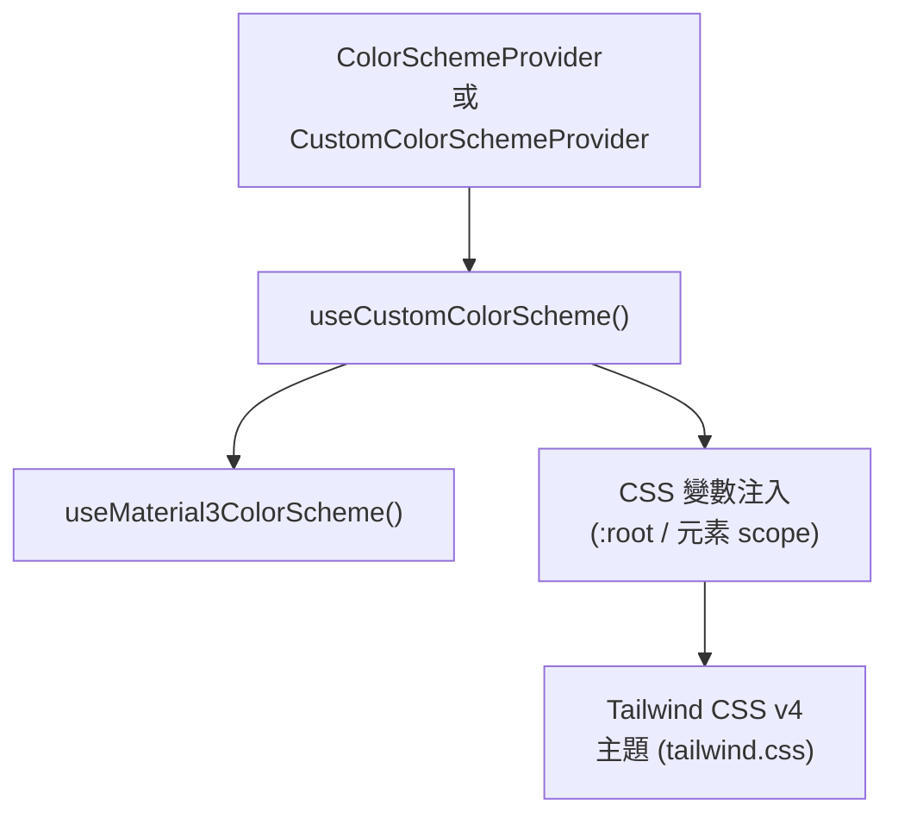

# 🎨 Color Scheme / 色彩主題系統

本頁記錄 Camelot Nuxt Layer 的色彩主題架構，涵蓋 Material Design 3 色彩系統、客製化方案與暗黑模式支援。

---

## 架構總覽



---

## 核心 Composable

### `useCustomColorScheme<T>(targetRef, config?)`

**用途**：將色彩方案物件轉換為 CSS 自訂屬性 (CSS Variables)，並注入至指定 DOM 元素或全域 `:root`。

**參數**：

| 參數 | 型別 | 說明 |
| :--- | :--- | :--- |
| `targetRef` | `MaybeElementRef` | 目標 DOM 元素；傳入 `document.documentElement` 時視為全域設定 |
| `config.lightColorScheme` | `CustomColorScheme<T>` | 亮色模式色彩方案 |
| `config.darkColorScheme` | `CustomColorScheme<T>` | 暗色模式色彩方案 |
| `config.editable` | `boolean` | 預設 `true`；設為 `false` 時不更新 CSS 變數（唯讀模式） |

**回傳值**：

| 值 | 說明 |
| :--- | :--- |
| `mode` | 當前色彩模式 (`'light' \| 'dark' \| 'auto'`)，使用 VueUse `useColorMode` |
| `lightColorScheme` | 亮色方案 Ref |
| `darkColorScheme` | 暗色方案 Ref |
| `usedColorScheme` | 根據 `mode` 自動切換的當前方案 Computed |

**CSS 變數命名規則**：

```
Material3 鍵值 (e.g., primary)
  → --cml-c-m3-primary    (內部變數)
  → --color-primary       (Tailwind 覆蓋變數)

自訂 Camelot 鍵值 (e.g., rippleColor)
  → --cml-c-ripple-color  (內部變數)
  → --color-ripple-color  (Tailwind 覆蓋變數)
```

> [!NOTE]
> 因 Tailwind CSS v4 將主題色彩放置於 `:root`，直接修改會被覆蓋。Layer 採用雙變數策略：內部變數 (`--cml-c-*`) 儲存值，覆蓋變數 (`--color-*`) 指向內部變數。

---

## 型別定義

### `CustomColorScheme<T>`

```typescript
type CustomColorScheme<T = any> = 
  Material3ColorSchemePartial   // M3 色彩（primary, secondary, error, surface 等）
  & Partial<CamelotColorScheme> // Camelot 額外色彩（rippleColor, maskColor）
  & Partial<T>                  // 消費端自訂擴展
```

### `CamelotColorScheme`

```typescript
type CamelotColorScheme = {
  rippleColor: string  // 漣漪點擊效果顏色
  maskColor: string    // 遮罩顏色
}
```

---

## 元件說明

### `CamelotColorSchemeProvider`

**用途**：全域色彩方案注入元件，對整個應用程式套用 Material3 + Camelot 預設色彩方案，並支援亮/暗模式自動切換。

**使用方式**（消費端）：
```vue
<template>
  <CamelotColorSchemeProvider
    :light-color-scheme="myLightScheme"
    :dark-color-scheme="myDarkScheme"
  >
    <NuxtPage />
  </CamelotColorSchemeProvider>
</template>
```

### `CamelotCustomColorSchemeProvider`

**用途**：區域色彩方案覆蓋元件，可在特定 DOM 範圍內套用不同的色彩方案（支援 Scoped CSS 變數），而不影響全域主題。

---

## Material3 色彩角色對照

主要使用的 Tailwind CSS 色彩 Utility（由 `tailwind.css` 定義）：

| Tailwind Class | CSS 變數 | 語意 |
| :--- | :--- | :--- |
| `bg-primary` | `--color-primary` | 主要強調色 |
| `text-on-primary` | `--color-on-primary` | Primary 上的文字色 |
| `bg-surface` | `--color-surface` | 背景表面色 |
| `text-on-surface` | `--color-on-surface` | 表面上的文字色 |
| `bg-surface-container` | `--color-surface-container` | 容器背景色（Hover 等） |
| `text-outline` | `--color-outline` | 邊框/次要文字色 |
| `text-error` | `--color-error` | 錯誤/假日色 |

---

## 相關檔案

| 檔案 | 說明 |
| :--- | :--- |
| [app/composables/useCustomColorScheme.ts](../../../app/composables/useCustomColorScheme.ts) | 色彩方案核心 Composable |
| [app/composables/useMaterial3ColorScheme.ts](../../../app/composables/useMaterial3ColorScheme.ts) | Material Design 3 色彩生成工具 |
| [app/assets/css/tailwind.css](../../../app/assets/css/tailwind.css) | Tailwind v4 主題變數定義 |
| [app/components/Camelot/ColorSchemeProvider.vue](../../../app/components/Camelot/ColorSchemeProvider.vue) | 全域 Provider 元件 |
| [app/components/Camelot/CustomColorSchemeProvider.vue](../../../app/components/Camelot/CustomColorSchemeProvider.vue) | 區域 Provider 元件 |

---

[🏠 Wiki](../index.md)
