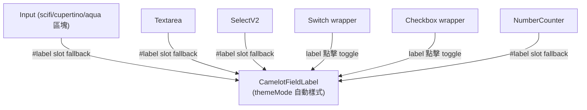

# 🏷️ FieldLabel 共通標籤與表單控制元件調整

> 來源計畫：[2606101443-playground-form-demos-and-aqua-switch](../../archive/2606101443-playground-form-demos-and-aqua-switch.md)（2026-06-10）

## CamelotFieldLabel（共通標籤元件）

`app/components/Camelot/FieldLabel.vue` — 表單元件 label 的單一來源。

- Props：`label?: string`、`required?: boolean`（星號 `text-error`）。
- 樣式依 `useCamelotTheme().themeMode` 自動切換：scifi → `text-xs uppercase tracking-[0.1em]`；其餘 → `text-sm font-medium text-on-surface`。
- 無預設 padding，由使用端傳 class（如 `pl-1`、aqua Input `pl-3`）。

### `#label` slot 統一模式

Input / Textarea / SelectV2 / Switch / Checkbox / NumberCounter 一律：

```vue
<slot name="label" :label="label">
  <CamelotFieldLabel :label="label" :required="required" class="pl-1" />
</slot>
```

- **slot props 帶 `label` 當前文字**，消費端可自定義渲染：

```vue
<CamelotInput label="Custom" ...>
  <template #label="{ label }">
    <span class="pl-1 text-sm font-bold text-[var(--cml-color-current-color)]">★ {{ label }}</span>
  </template>
</CamelotInput>
```

- Switch / Checkbox 的 label 由 **wrapper 層**渲染（theme variant 無 label prop），label 點擊可 toggle（disabled 時 `opacity-40 cursor-not-allowed` 且不可點）。
- Material Input 例外：使用 M3 floating label（內建於 `Material/Input.vue`），不走 FieldLabel。



## Switch 尺寸統一（貼齊 Checkbox 高度 20px）

| 主題 | 原尺寸 | 新尺寸 | Thumb |
| :--- | :--- | :--- | :--- |
| Aqua | 51×31 | **40×22** | 18 |
| Material | 52×32 | **40×22** | 未選 12 / 選中 16 |
| Cupertino | 51×31 | **40×22** | 18 |
| Scifi | 60×24 | **48×22**（保留 ON/OFF 文字） | 14 |

Checkbox 打勾放大：Aqua/Material 8×4 → 10×6；Cupertino 6×10 → 8×12；Scifi 為方塊指示器不變。

## NumberCounter 四主題化

- 容器分支：aqua（`aqua-track` 膠囊 + focus `aqua-glow`）/ cupertino（`bg-surface-container-highest` 圓角面板）/ scifi（current-color 5% 底 + 30% 髮絲框、直角）/ 預設（圓膠囊 + `border-outline-variant`）。
- focus 邊框由硬編 `--cml-c-m3-primary` 改為 `--cml-color-current-color`；新增 `color` / `disabled` / `label` / `required` props。
- **Bug 修復**：step watch 結尾原無條件 `absStep.value = 1`，導致 `step` / `minStepByValue` 全失效；改為僅於無設定時 fallback（保留 `usedMinStepByValue` 的「曾經 step」語意）。

## 行為修正

- **SelectV2 disabled**：`:disabled` 傳入 `CamelotPopupV2`（disabled 時不可展開）；樣式改根節點 `cursor-not-allowed opacity-50`（與 Input 一致）；修正失效 class `text-primary-text` / `text-secondary-text` → `text-on-surface` / `text-on-surface-variant`（theme 無 `--color-*-text` 定義，Tailwind v4 不會產生未知 utility）。
- **Tree 整行點擊**：checkable 時點整行（含空白處）切換勾選，展開交由 chevron 按鈕；非 checkable 維持點行展開。
- **TimeField 下拉防裁切**：時/分/秒下拉改 `Teleport to="body"` + fixed 定位（依 trigger 上方空間自動向上/向下展開）。Teleport 後脫離 color role CSS 變數注入範圍，故將 `--cml-color-current-color` 以 inline style 帶入；`onClickOutside` 設 `ignore: [listRef]` 避免點選項誤關。
- **SelectV2 選項面板間距與寬度**（2026-06-11）：選項列表 wrapper `pb-2` → `py-2`，上下留白對稱（aqua 玻璃面板 `p-1` + `py-2` = 各 12px，單一選項時垂直置中）；`popupWidthMode` 預設 `same-target` → `min-target`（面板 `min-width` 同 trigger、`width: max-content` 隨內容加寬），長選項文字不再溢出 hover 背景貼到面板邊界。需鎖定同寬時個別傳 `popup-width-mode="same-target"`。

## References

- 原裁切成因：`PopupV2` 的展開動畫容器 `Expanded.vue` 使用 `overflow-hidden`（動畫所需，不可移除）。
- 失效色彩 class 清單修正另見 [SelectV2 顏色 token]；`--color-*` 定義集中於 `app/assets/css/tailwind.css` `@theme`。

---
[🎨 主題系統](theme-system.md) | [🧱 版面/資料元件](layout-data-components.md) | [⏰ TimeV2](time-picker.md) | [🏠 Wiki](../index.md)
