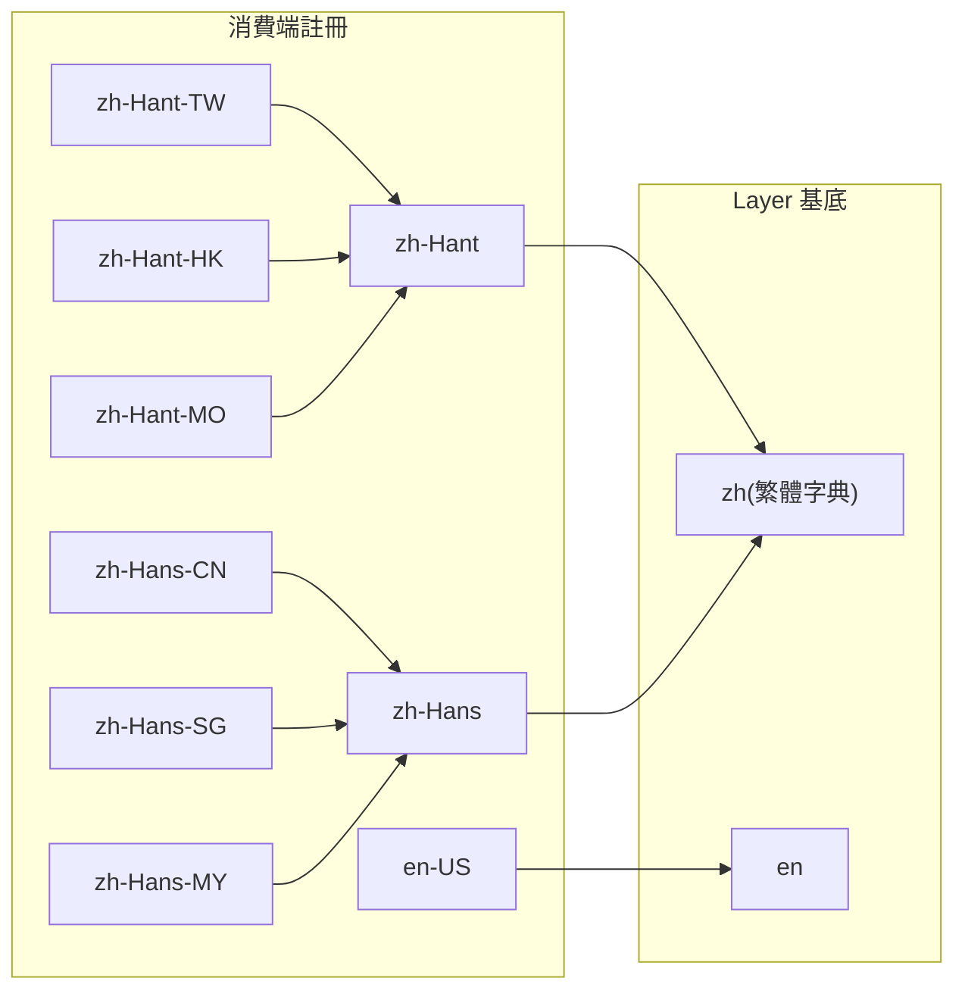

# 🌐 i18n 語系系統(CLDR 代碼 + Fallback 鏈 + Layer/消費端分工)

> Layer 只提供**語言層級**基底字典(`en` / `zh`),區域語系由消費端註冊並透過 fallback 鏈落回基底。
> 對應計畫 `2607021527`。

## 分工原則

Layer 的 `i18n.locales` 會被消費端 app **繼承合併**,因此:

| 層 | 職責 | 語系 |
| :--- | :--- | :--- |
| **Layer**(`i18n/`) | 語言層級基底字典,保證 fallback 終點存在 | `en`、`zh`(繁體,defaultLocale) |
| **消費端**(範例:`.playground/i18n/`) | 註冊區域語系(CLDR 代碼)與自己的 fallback 鏈 | `zh-Hant-TW/HK/MO`、`zh-Hans-CN/SG/MY`、`zh-Hant`/`zh-Hans` 基底、`en-US` |

## Fallback 鏈



- 每個 locale 對應**單一檔案**,fallback 由 vue-i18n 於執行期解析(非 `files` 合併)。
- 區域覆寫檔只放該地區的差異 key(如 `zh-Hant-TW.json` 只有 `login`),其餘 key 逐層退回。
- 簡體完整字典在消費端的 `zh-Hans.json`;Layer 的 `zh` 為繁體,簡體鏈終點僅為最後保險。

## 關鍵設定

### Layer — `i18n/i18n.config.ts`

```ts
fallbackLocale: {
  'en-US': ['en'],
  'default': ['zh'],
}
```

vue-i18n 對 `zh-Hant-TW` → `zh-Hant` → `zh` 有**隱含階層 fallback**,Layer 不需列舉區域語系。

### 消費端 — `.playground/i18n/i18n.config.ts`

顯式列出完整鏈(終點補 `'zh'`):`zh-Hant-*` → `['zh-Hant', 'zh']`、`zh-Hans-*` → `['zh-Hans', 'zh']`、`en-US` → `['en']`。

## 陷阱與實測結論

1. **`restructureDir: 'i18n'` 後,`vueI18n` 路徑以 `i18n/` 目錄為基準**——設定檔放專案根目錄不會被載入(`nuxt prepare` 只給 WARN 就跳過),`fallbackLocale` 形同虛設。
2. **多 layer 合併**:@nuxtjs/i18n 會合併各 layer 的 `locales` 與 vueI18n 設定(專案層優先);合併後 fallback map 同 key 可能出現重複項(如 `en-US: ['en','en']`),無害。
3. **瀏覽器偵測順序敏感**:`detectBrowserLanguage` 對 `zh-TW` 這類簡式代碼以語言前綴比對,取 locales **清單中第一個**命中者——區域語系必須排在通用基底之前,否則初始語系會落在 `zh-Hant` 而非 `zh-Hant-TW`。
4. **`nuxt.config.ts` 的 i18n 區塊不在 HMR 範圍**,改動需重啟 dev server。

## References

- [vue-i18n Fallbacking](https://vue-i18n.intlify.dev/guide/essentials/fallback.html)
- [@nuxtjs/i18n locales 選項](https://i18n.nuxtjs.org/docs/api/options#locales)
- 計畫歸檔:`../../archive/2607021527-i18n-cldr-locales-fallback.md`
- 語系格式正規化 composable:[[locale]]([useLocale](./locale.md))

---

[🌐 useLocale](./locale.md) | [🏠 Wiki](../index.md)
