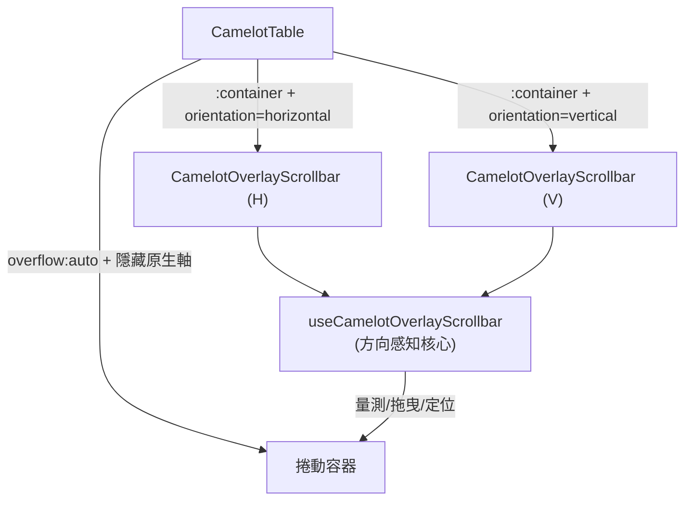

# 📜 OverlayScrollbar / 自訂捲軸系統

`CamelotOverlayScrollbar` 是**附著在既有捲動容器上**的自訂 overlay 捲軸（不自建容器），以 `orientation` prop 切換水平/垂直。Table 兩軸皆改用此元件取代原生捲軸。

> 與既有 `CamelotScrollbar`（**包裝式**，自建捲動容器 + slot，用於 Container/playground）定位不同，兩者並存。

---

## 架構

- **`useCamelotOverlayScrollbar`**（core）：方向感知，抽象「主軸(main)/交叉軸(cross)」——水平 main=X（scrollLeft/scrollWidth/clientWidth）、垂直 main=Y（scrollTop/scrollHeight/clientHeight）。負責量測、thumb 幾何、拖曳、hover、docking/浮動。
- **`CamelotOverlayScrollbar`**（元件）：呼叫 core，渲染 track + thumb + bar（`<Teleport :disabled>` 於水平浮動態）。

---

## `CamelotOverlayScrollbar` Props

| Prop | 型別 | 預設 | 說明 |
| :--- | :--- | :---: | :--- |
| `container` | `HTMLElement \| null` | — | 目標捲動容器（附著其上） |
| `orientation` | `'horizontal' \| 'vertical'` | — | 捲軸方向 |
| `floatingEnabled` | `boolean` | `false` | 僅水平：表格底出視窗時是否浮動到視窗底 |
| `color` | `CamelotColorRole` | `primary` | thumb 上色（走 `var(--color-{role})`） |
| `startInset` | `number` | `0` | 主軸起點偏移（如垂直軸避開 sticky 表頭傳 headerHeight） |

## 行為

- **thumb 尺寸**：`未 hover 4px / hover 8px`（`transform: scaleY`(水平往上長)／`scaleX`(垂直往右靠、往左長)，帶淡邊 box-shadow）。命中區 10px。
- **水平 docking/浮動**：docked 時 `position: absolute` 留在容器內（被圓角裁切）；`floatingEnabled` 且表格底出視窗時 `<Teleport>` 至 body、`position: fixed` 於視窗底。
- **垂直**：恆 docked 於右側，`startInset` 使其從表頭下方起（可覆蓋固定列）。
- **重新量測**：監聽容器/window scroll、resize、`ResizeObserver`（容器 **與內容元素** ——換頁/資料變動時容器 box 不變、內容 scrollHeight 改變仍會重算，捲軸即時出現）。

---

## Table 整合

- 捲動容器 `overflow: auto`（保留原生滾輪/觸控/鍵盤），`scrollbar-width: none` + `::-webkit-scrollbar { display: none }` 隱藏**雙軸**原生軸。
- 疊兩個 `CamelotOverlayScrollbar`（水平 `floatingEnabled=floatingScrollbar` prop、垂直傳 `startInset=headerHeight`）。
- **保留空間（gutter）**：以**透明 border**（非 padding）保留右/底捲軸空間——`overflow` 裁切在 padding box，內容不進 border 區 → gutter 乾淨不漏、固定欄/列停在邊緣。寬度 6px（= 未 hover bar 4 + 內縮 2）。
- **可開關**：Table `reserveVerticalScrollbar` / `reserveHorizontalScrollbar`（預設 true）；關閉則不加 border gutter、捲軸直接覆蓋於表上。

### Table 捲軸相關 props

| Prop | 型別 | 預設 | 說明 |
| :--- | :--- | :---: | :--- |
| `height` | `string` | — | 固定高度（內容少於容器時不縮短） |
| `maxHeight` | `string` | — | 高度上限（內容少時縮短） |
| `floatingScrollbar` | `boolean` | `true` | 水平軸表格底出視窗時是否浮動 |
| `reserveVerticalScrollbar` | `boolean` | `true` | 是否保留垂直捲軸 gutter |
| `reserveHorizontalScrollbar` | `boolean` | `true` | 是否保留水平捲軸 gutter |
| `color` | `CamelotColorRole` | `primary` | 捲軸/列 hover/表頭底線的色彩角色 |

---

## 踩過的坑（重要）

- **transform 期間 backdrop/height transition 不穩**：thumb 拆父(定位)子(視覺 bar)兩層，bar 的放大 transition 不被拖曳頻繁 re-render 重啟。
- **依方向隱藏原生軸無效**：`::-webkit-scrollbar:horizontal` 在此引擎無效 → 改整體隱藏 + 自訂雙軸。
- **padding gutter 會漏內容**：捲動容器 padding 區會顯示捲動內容 → 改透明 border（overflow 裁切於 padding box 內）。
- **內容變動不重算**：需 `ResizeObserver` 觀察**內容元素**（非只容器 box）。

---

## References

- 實作：`app/components/Camelot/OverlayScrollbar.vue`、`app/composables/useCamelotOverlayScrollbar.ts`、`app/components/Camelot/Table.vue`
- 計畫歸檔：`../../archive/2607081704-overlay-scrollbar-component.md`（元件化）、`../../archive/2607081506-table-floating-hscrollbar.md`（前身浮動軸）、`../../archive/2607081458-table-fixed-height.md`（height prop）
- 既有包裝式：`app/components/Camelot/Scrollbar.vue`

---

[🧱 版面/資料/導覽元件](./layout-data-components.md) | [🏠 Wiki](../index.md)
