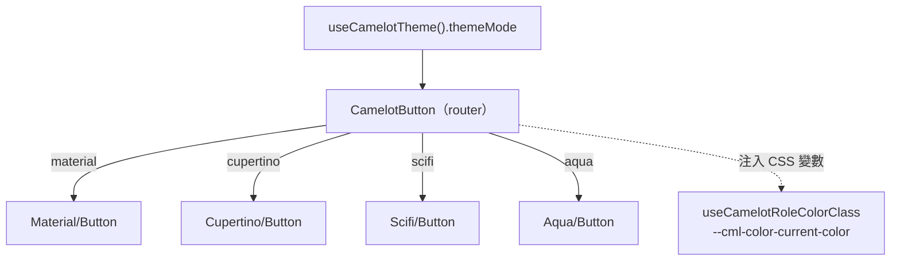

# 🎨 主題系統 / Theme System（四風格 + Aqua）

> Camelot 的「統一元件 → 多風格實作」主題系統。所有可主題化元件會依當前 `themeMode` 切換為對應風格的外觀，共享相同 props/emits 介面。

## 🧭 概覽

| 項目 | 說明 |
| :--- | :--- |
| 風格（`themeMode`） | `material`（Material 3）、`cupertino`（Apple）、`scifi`（HUD）、`aqua`（Frosted Glass 玻璃擬態） |
| **預設主題** | **`aqua`**（新使用者首次進入即為玻璃風格） |
| 狀態管理 | `useCamelotTheme()` — `useLocalStorage('cml-theme-mode', 'aqua')`，並寫入 `data-camelot-theme-mode` / `--cml-active-ui-style` |
| 樣式核心 | Tailwind CSS v4；共用樣式集中於 `app/assets/css/tailwind.css` 的 `@utility` / `@theme` |
| 色彩 | 沿用 `--color-{role}` token（Material 3 色彩系統）；不另立色票 |

## 🏗️ 架構：Router 模式

`Button` / `Input` / `Switch` / `Checkbox` 為「路由器元件」：本身不畫 UI，依 `themeMode` 渲染對應風格的子元件（`Material/` `Cupertino/` `Scifi/` `Aqua/`）。其餘可主題化元件（Tabs、Dialog、Steps、Select、Skeleton、Toast、Loading、DatePicker…）則在元件內以 `v-if="themeMode === ..."` 分支。

## 💧 Aqua（Frosted Glass）視覺語言

玻璃擬態：半透明 + `backdrop-blur` + 髮絲邊 + 柔光 + spring 動畫。共用 `@utility`（`tailwind.css`）：

| utility | 用途 |
| :--- | :--- |
| `aqua-glass` | 浮層/面板：半透明 + blur + 髮絲白邊 + 柔影（Dialog、Select 浮層、DatePicker 面板…） |
| `aqua-fill` | 填滿態：135° 漸層 + 頂部內高光 + 收緊柔光（按鈕、選中 pill、checkbox 勾選、switch 開） |
| `aqua-track` | 軌道/未選態：髮絲級半透明底 + 細邊 |
| `aqua-glow` | 聚焦光暈（可加 `focus:` / `focus-within:` 變體） |
| `aqua-thumb` | 玻璃光澤拖點（switch thumb） |

## 🧩 相關 Composables / 型別

| 名稱 | 說明 |
| :--- | :--- |
| `useCamelotTheme` | 主題切換狀態（themeMode / colorMode / 色彩方案 / setThemeColor…） |
| `useCamelotRoleColorClass` | 將 `color` 角色解析為設定 `--cml-color-current-*` 的 Tailwind class（取代 router 的 computed `:style`） |
| `useCamelotPickerTheme` | DatePicker 各風格的 `triggerClass` / `panelClass` / `selectedSurfaceClass` |
| `CamelotColorRole`（`shared/types/camelot.ts`） | 共用色彩角色 union（primary/secondary/tertiary/error/info/warning/success） |

## 🔧 Tailwind v4 重構重點

- `computed` 動態 style 與 `<style scoped>` 盡量改為 Tailwind utility / `before:`·`after:` variants / arbitrary values。
- 共用 keyframes（如 `scifi-scan`）與緩動（`ease-spring`、`ease-ios`）集中於 `tailwind.css` 的 `@theme`。
- 仍保留少量 scoped CSS 之元件（合理）：含 `@keyframes`、`::-webkit-scrollbar`、`<transition-group>`、`:deep()` 者（Scrollbar、RippleEffect、Reveal*、NumberCounter、Scifi Frame/Reticle、Scifi Switch/Checkbox…）。
- 已移除被 `aqua` 取代的 `cyber` 風格死碼。

## 📌 References
- 歸檔計畫：[2606081005-aqua-complete-and-tailwind-refactor](../../archive/2606081005-aqua-complete-and-tailwind-refactor.md)
- 色彩主題細節：[Color Scheme](./color-scheme.md)
- 主要檔案：`app/composables/useCamelotTheme.ts`、`app/assets/css/tailwind.css`、`app/components/Camelot/{Aqua,Material,Cupertino,Scifi}/*`

---

[🎨 色彩主題](./color-scheme.md) | [🧱 Drawer/Tree/Table/Menu](./layout-data-components.md) | [⚙️ 環境變數](../environment.md) | [🏠 Wiki](../index.md)
