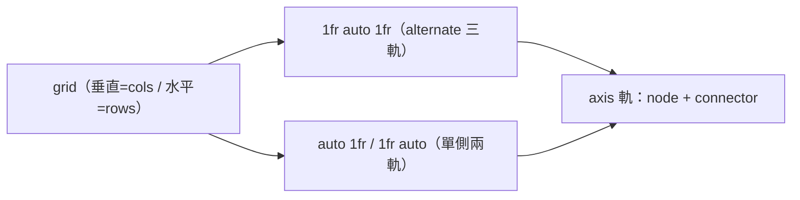

# 🕒 Timeline 時間軸

> 來源計畫：[2606101900-ui-batch](../../archive/2606081900-ui-batch.md)、[2606101530-timeline-alignment-and-image](../../archive/2606101530-timeline-alignment-and-image.md)

`app/components/Camelot/Timeline.vue` — 垂直/水平時間軸，支援交錯排列、捲動淡入、四主題 color role。

## Props / Item

| Prop | 型別 | 預設 | 說明 |
| :--- | :--- | :--- | :--- |
| `items` | `TimelineItem[]` | — | `{ title?, content?, image?, key? }` |
| `direction` | `'vertical' \| 'horizontal'` | `vertical` | 排列方向 |
| `side` | `'before' \| 'after' \| 'alternate'` | `after` | 內容位置（垂直：左/右；水平：上/下；alternate 交錯） |
| `color` | `CamelotColorRole` | `primary` | 圓點顏色（`--cml-color-current-color`） |
| `animate` | `boolean` | `false` | IntersectionObserver 捲動逐一淡入 |

Slots：`#title` / `#content` / `#node`（皆帶 `{ item, index }`）。

## 版面機制

- **垂直對齊**（2606101530）：axis `justify-start + pt-1.5`，12px 圓點中心 = 標題 `text-base` 24px 行高中心；水平模式圓點置中於軸列。
- **連接線**：每項上下兩段（`i>0` 上段 `top-0 h-3`、`i<last` 下段 `top-3 bottom-0`），相鄰列無縫接續——列高不一（含圖片）仍為連續直線。
- **圖片內容**：`item.image` 渲染於文字下（`w-[200px] rounded-lg border`）；`before` 側 `ml-auto` 靠右貼軸、水平模式 `mx-auto` 置中；自訂 `#content` slot 時不套用。

## References
- Playground 展示：`.playground/app/pages/index.vue`（vertical alternate + vertical + horizontal alternate、「出貨」項目含圖）。

---
[🧱 版面/資料元件](layout-data-components.md) | [🎨 主題系統](theme-system.md) | [🏠 Wiki](../index.md)
