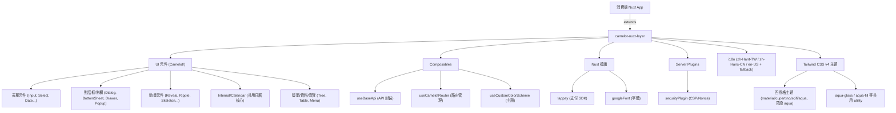

# 📚 Camelot Nuxt Layer — Wiki 首頁

> 本 Wiki 是專案知識的中樞，涵蓋架構、元件目錄、環境設定與開發規範。

## 🌐 語言切換 (Language Switcher)
- 🇹🇼 **正體中文** (當前)
- 🇺🇸 [English](./lang/en-US/index.md) *(尚未建立)*

---

## 📋 專案概覽

**Camelot Nuxt Layer** 是一個 Nuxt Layer 形式的 UI 元件函式庫，提供各種可複用的 Vue 3 元件、Composables 與工具模組，供各類 Nuxt 4 應用程式擴展使用。

| 項目 | 說明 |
| :--- | :--- |
| **套件名稱** | `camelot-nuxt3-layer` |
| **版本** | `4.3.1.12` |
| **框架** | Nuxt 4 + Vue 3 (Composition API) |
| **樣式** | Tailwind CSS v4 |
| **狀態管理** | Pinia + pinia-plugin-persistedstate |
| **多語系** | @nuxtjs/i18n (Layer 基底 en / zh；區域語系由消費端註冊 fallback 至基底，範例見 .playground) |
| **套件管理** | pnpm |

---

## 🗂️ 功能清單矩陣 (Functional Inventory Matrix)

### UI 元件 (`app/components/Camelot/`)

> 🎨 多數元件支援四種主題（material / cupertino / scifi / **aqua**，預設 aqua）。詳見 [主題系統](./features/theme-system.md)。

| 元件 | 狀態 | 說明 | Wiki |
| :--- | :---: | :--- | :--- |
| `BaseBottomSheet` | ✅ | 底部彈出面板 (v1) | — |
| `BaseBottomSheetV2` | ✅ | 底部彈出面板 (v2，精簡版) | — |
| `BaseDialog` | ✅ | 通用對話框 (v1) | — |
| `BaseDialogV2` | ✅ | 通用對話框 (v2，支援更多選項) | — |
| `Breakpoints` | ✅ | 顯示當前斷點（開發工具用） | — |
| `CascadeMenu` | ✅ | 點擊觸發、子選單向側邊飛出的多階層彈出選單（Teleport+fixed、掛載凍結定位、自動翻轉、四風格、CurrentColor；與行內手風琴式 `Menu` 區隔） | [詳情](./features/layout-data-components.md) |
| `ColorSchemeProvider` | ✅ | 主題色彩 Provider | [詳情](./features/color-scheme.md) |
| `Container` | ✅ | 通用容器元件 | — |
| `CustomColorSchemeProvider` | ✅ | 自訂色彩方案 Provider | [詳情](./features/color-scheme.md) |
| `Date` | ✅ | 日期選擇器 (v1，舊版) | — |
| `DateV2` | 🚧 | 日期選擇器 (v2，重構中) | [詳情](./features/calendar.md) |
| `DateRange` | ✅ | 日期範圍選擇器 (v1，舊版) | — |
| `DateRangeV2` | 🚧 | 日期範圍選擇器 (v2，重構中) | [詳情](./features/calendar.md) |
| `Drawer` | ✅ | 側邊抽屜（左右、floating/fixed、四風格） | [詳情](./features/layout-data-components.md) |
| `DropImage` | ✅ | 拖曳上傳圖片元件 | — |
| `Expanded` | ✅ | 可展開/收合的內容區塊 | — |
| `FileChip` | ✅ | 附件晶片（縮圖/型別色塊 + 檔名 + 副檔名·大小 + 移除鈕） | [詳情](./features/file-drop.md) |
| `FileDropzone` | ✅ | 任意檔案拖曳/選擇 + 附件晶片列 | [詳情](./features/file-drop.md) |
| `FieldLabel` | ✅ | 表單共通標籤（主題自動樣式、required 星號；各表單元件 `#label` slot 的 fallback） | [詳情](./features/field-label-and-form-controls.md) |
| `Gpu` | ✅ | GPU 加速動畫容器 | — |
| `IdxForm` | ✅ | 表單容器元件 | — |
| `Image` | ✅ | 圖片元件 (v1) | — |
| `ImageV2` | ✅ | 圖片元件 (v2，支援懶載入/動畫) | — |
| `ImageDropzone` | ✅ | 圖片拖曳/選擇區（stacked / grid 多格、slot 驅動、max、四風格；核心共用 useCamelotFileDrop） | [詳情](./features/file-drop.md) |
| `Input` | ✅ | 通用輸入框元件（`#label` slot 帶 label 參數） | [詳情](./features/field-label-and-form-controls.md) |
| `Loading` | ✅ | 載入中動畫元件 | — |
| `Material3Provider` | ✅ | Material Design 3 主題 Provider | — |
| `Menu` | ✅ | 多階層導覽選單（導引線/祖先變色、四風格） | [詳情](./features/layout-data-components.md) |
| `NumberCounter` | ✅ | 數字加減輸入（四風格、color/disabled/label） | [詳情](./features/field-label-and-form-controls.md) |
| `Popup` | ✅ | 彈出層元件 (v1) | — |
| `PopupV2` | ✅ | 彈出層元件 (v2，功能更完整) | — |
| `Radio` | ✅ | 單選（四風格、deselectable、滿版+scale 圓點防半像素偏移） | [詳情](./features/radio-and-groups.md) |
| `RadioGroup` | ✅ | 單選群組（水平/垂直、整組/逐選項 disabled、deselectable） | [詳情](./features/radio-and-groups.md) |
| `CheckboxGroup` | ✅ | 勾選群組（水平/垂直、整組/逐選項 disabled） | [詳情](./features/radio-and-groups.md) |
| `RevealImage` | ✅ | 圖片揭示動畫元件 | — |
| `RevealText` | ✅ | 文字揭示動畫元件 | — |
| `RippleEffect` | ✅ | Material Design 漣漪點擊效果 | — |
| `RippleTabs` | ✅ | 帶漣漪效果的 Tab 元件 | — |
| `RichTextEditor` | ✅ | TipTap 富文本編輯器（四風格、可插拔上傳、resizable image/貼上清洗） | [詳情](./features/richtext-editor-image-dropzone.md) |
| `Scrollbar` | ✅ | 自訂滾動條元件 | — |
| `Select` | ✅ | 下拉選擇元件 (v1) | — |
| `SelectV2` | ✅ | 下拉選擇元件 (v2；disabled 不可展開、`#label` slot、選項面板 min-target 寬度；選項選中/hover 效果與 `CascadeMenu` 共用 `useCamelotMenuItemTheme`) | [詳情](./features/field-label-and-form-controls.md) |
| `Switch` | ✅ | 開關（四風格 40×22 / scifi 48×22、label 點擊切換） | [詳情](./features/field-label-and-form-controls.md) |
| `Checkbox` | ✅ | 勾選框（四風格、indeterminate、label 由 wrapper 統一） | [詳情](./features/field-label-and-form-controls.md) |
| `Textarea` | ✅ | 多行輸入（autosize、字數統計、`#label` slot） | [詳情](./features/field-label-and-form-controls.md) |
| `Skeleton` | ✅ | 骨架屏 Loading 佔位元件 | — |
| `SlideTransitionGroup` | ✅ | 滑動過場群組元件 | — |
| `Steps` | ✅ | 步驟指示器元件 | — |
| `Table` | ✅ | 資料表格（fixed header/columns/rows、雙色/hover、slot、泛型、四風格） | [詳情](./features/layout-data-components.md) |
| `Tabs` | ✅ | 頁籤元件（四風格 + 滑動指示器） | [詳情](./features/theme-system.md) |
| `TimeV2` | ✅ | 純時間選擇器（trigger + popup/dialog + TimeRow，v-model "HH:mm[:ss]"，四風格） | [詳情](./features/time-picker.md) |
| `Timeline` | ✅ | 時間軸（垂直/水平、alternate、捲動淡入、圓點對齊標題行、image 內容） | [詳情](./features/timeline.md) |
| `Toast` | ✅ | 吐司通知元件（透明玻璃、滑入漸入、8 方位、center 不跳動） | [詳情](./features/datepicker-time-aqua-toast.md) |
| `Tree` | ✅ | 多階層樹（勾選連動 + indeterminate、四風格） | [詳情](./features/layout-data-components.md) |

### 內部元件 (`app/components/Camelot/Internal/`)

| 元件 | 狀態 | 說明 | Wiki |
| :--- | :---: | :--- | :--- |
| `Calendar` | 🚧 | 日曆核心元件（DateV2/DateRangeV2 共用，四風格選中態） | [詳情](./features/calendar.md) |
| `TreeNode` | ✅ | Tree 遞迴節點（checkable 點整行勾選） | [詳情](./features/layout-data-components.md) |
| `MenuItem` | ✅ | Menu 遞迴項目 | [詳情](./features/layout-data-components.md) |
| `CascadeMenuPanel` | ✅ | CascadeMenu 遞迴飛出面板（Teleport+fixed 凍結定位、自動翻轉、四風格） | [詳情](./features/layout-data-components.md) |
| `TimeField` | ✅ | 時/分/秒欄位（下拉 Teleport 防裁切） | [詳情](./features/field-label-and-form-controls.md) |

---

### Composables (`app/composables/`)

| Composable | 狀態 | 說明 |
| :--- | :---: | :--- |
| `useLocale` | ✅ | 語系格式正規化（`bcp47`/`cldr`/`l10n` 三格式、CLDR 11 語言查表、bcp47⇄cldr 雙向輸入）— [詳情](./features/locale.md) |
| `useBaseApi` | ✅ | API 請求基礎封裝 (含串流支援) |
| `useCamelotTheme` | ✅ | 主題切換狀態（themeMode / colorMode / 色彩方案，預設 aqua） |
| `useCamelotRoleColorClass` | ✅ | 色彩角色 → 注入 `--cml-color-current-*` 的 Tailwind class |
| `useCamelotMenuItemTheme` | ✅ | 選單/選項列四風格 active/hover 效果（`CascadeMenu` 與 `SelectV2` 選項共用，消費 CurrentColor） |
| `useCamelotPickerTheme` | ✅ | DatePicker 各風格 trigger/panel/選中態 class |
| `useCamelotFileDrop` | ✅ | 檔案拖曳 headless 核心（任意元素變拖曳區；entries 含型別/大小/縮圖） |
| `useCamelotRouter` | ✅ | 擴展 Vue Router，含歷史堆疊管理 |
| `useCamelotToast` | ✅ | Toast 通知系統 |
| `useColor` | ✅ | 顏色處理工具 |
| `useCustomColorScheme` | ✅ | 自訂色彩方案管理 |
| `useDeviceBreakpoints` | ✅ | 裝置斷點偵測 |
| `useElCssVar` | ✅ | 讀取/設定元素 CSS 變數 |
| `useErrorRef` | ✅ | 錯誤狀態封裝 |
| `useFetchStream` | ✅ | Fetch 串流請求 |
| `useFetchJSONLinesStream` | ✅ | JSON Lines 串流請求 |
| `useFloat` | ✅ | 浮點數處理工具 |
| `useInfinitePage` | ✅ | 無限滾動分頁邏輯 |
| `useInputValidationController` | ✅ | 表單驗證控制器 |
| `useLoading` | ✅ | 全域載入狀態管理 |
| `useMaterial3ColorScheme` | ✅ | Material Design 3 色彩方案生成 |
| `useObject` | ✅ | 物件操作工具集 |
| `useScrollOnBottom` | ✅ | 捲動到底部事件偵測 |
| `useValueValidation` | ✅ | 值驗證工具 |
| `useNaiveUITheme` | ✅ | NaiveUI 主題整合 |
| *(其他工具型 Composables)* | ✅ | useDelay, useRandom, useFileKey 等 |

---

### Nuxt 模組 (`modules/`)

| 模組 | 狀態 | 說明 |
| :--- | :---: | :--- |
| `tappay` | ✅ | 依 `runtimeConfig` 條件注入 TapPay SDK |
| `googleFont` | ✅ | 自動注入 Noto Sans TC Google Fonts |
| `buildHook` | ✅ | 建置期 Hook |
| `echartModule` | ✅ | ECharts 整合模組 |

---

### 伺服器功能 (`server/`)

| 項目 | 狀態 | 說明 |
| :--- | :---: | :--- |
| `server/plugins/securityPlugin` | ✅ | CSP Headers、Nonce 注入、安全標頭設定 |
| `server/api/version` | ✅ | `GET /api/version` — 回傳應用程式版本號 |

---

## 🗺️ 架構圖

---

## 📎 快速導覽

- [🎨 Theme System / 主題系統（四風格 + Aqua）](./features/theme-system.md)
- [🧱 Drawer / Tree / Table / Menu](./features/layout-data-components.md)
- [🗓️ Calendar / 日期選擇器](./features/calendar.md)
- [🗓️🔔 DatePicker 時間/確認・Aqua 邊框 Token・Toast 動畫](./features/datepicker-time-aqua-toast.md)
- [✍️🖼️ RichTextEditor（TipTap）與 ImageDropzone](./features/richtext-editor-image-dropzone.md)
- [⏰ TimeV2 / 純時間選擇器](./features/time-picker.md)
- [🏷️ FieldLabel 共通標籤與表單控制元件](./features/field-label-and-form-controls.md)
- [🕒 Timeline 時間軸](./features/timeline.md)
- [📎 檔案拖曳系統（FileDropzone / FileChip / useCamelotFileDrop）](./features/file-drop.md)
- [🔘 Radio 與選項群組（RadioGroup / CheckboxGroup）](./features/radio-and-groups.md)
- [🎨 Color Scheme / 色彩主題](./features/color-scheme.md)
- [🌐 useLocale / 語系格式正規化](./features/locale.md)
- [⚙️ 環境變數](./environment.md)

---

[⚙️ 環境變數](./environment.md) | [🏠 Wiki](index.md)
