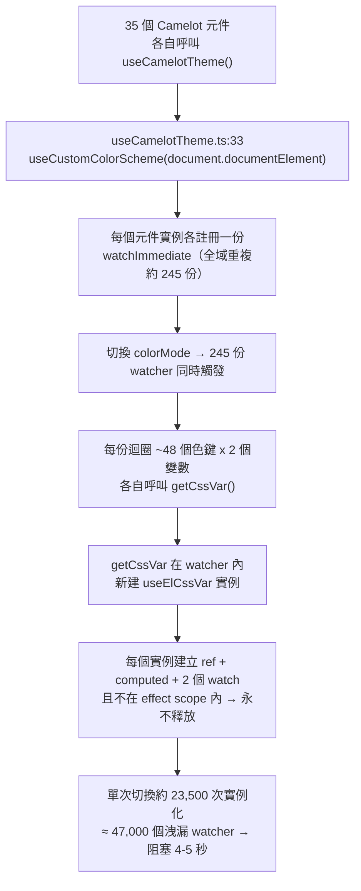

# Plan: 2608120958 - color-mode-switch-jank
- Created: 2026-08-12
- Branch: fix/2608120958-color-mode-switch-jank
- Issue: KNightING/camelot-nuxt-layer#17
- Status: In Progress
- Completed: [Wait for Finish]

## Goals

消除 light / dark（以及主題風格、色系）切換時的主執行緒停頓。

於 `.playground` 首頁實測，點擊 Light / Dark 後主執行緒被單一 long task 阻塞 **4.3 ～ 5.4 秒**，期間畫面完全凍結、無法互動。目標是把切換成本壓到 **一次 style recalc 的等級（< 100ms）**，並同時消除隨每次切換累積的 watcher 洩漏。

## Architecture

### 現況量測（於 `.playground` 首頁，1736 個 DOM 節點）

| 指標 | 量測值 |
| :--- | :--- |
| 點擊到主執行緒解除阻塞 | 4340 / 5028 / 5382 ms（三次） |
| PerformanceObserver longtask | 單一 `self` task，5028 ms |
| 同步 click handler 本身 | 1 ms |
| `CSSStyleDeclaration.setProperty` 呼叫 | **43 次，合計 0 ms** |
| `getPropertyValue` 呼叫 | **23,520 次** |
| 純 CSS 層成本（手動切 `dark`/`light` class + 加上 `cml-theme-transitioning`）| 約 40 ～ 52 ms |

結論：**成本完全不在 CSS，也不在真正的變數寫入，而在 JS 的 reactivity 建置**。堆疊取樣把 23,520 次 `getPropertyValue` 全數指向 `app/composables/useElCssVar.ts:21` 的 `updateCssVar`，且來源是 Vue 的 watcher job。

### 根因鏈

1. **全域訂閱者重複**：`useCamelotTheme()` 被 35 個元件檔呼叫，playground 首頁上約 245 個實例，每個實例都在 `useCustomColorScheme` 內獨立註冊一份 `watchImmediate`，各自把**同一組**變數寫到**同一個** `<html>`。245 份工作中有 244 份是純冗餘。
2. **在 watcher 內建立 reactive 實例**：`getCssVar()` 每次呼叫都 `new` 一個 `useElCssVar`。它在建立時做一次 `getComputedStyle`/`getPropertyValue`（這就是 23,520 次的來源），並註冊兩個常駐 `watch`。因為是在 watcher callback 內建立、不在任何 effect scope 中，**這些 watcher 永遠不會被回收**——每切一次就洩漏約 47,000 個。
3. **每鍵重建字串轉換器**：`useChangeCase` 在迴圈內逐鍵設值，屬於熱路徑內的重複配置（違反 code-style TypeScript 第 2 條）。

`useMaterial3ColorScheme.ts:269` 的 target-scoped watcher 有**完全相同**的 `getCssVar`-in-watcher 寫法，實例數較少但屬同一類缺陷，一併修正以免日後復發。

### ⚠️ 根因修正（使用者回報後）

初版量測在**隱藏分頁**中進行，`visibilityState: hidden` 導致背景節流，把 5028ms 的 wall-clock 誤判為 CPU 阻塞。使用者實測回報「light/dark 仍卡，但主題風格 / 色系 / 品牌色切換都很快」——這條線索推翻了原本的歸因。

三種切換共用同一個 `triggerThemeTransition()` 過場與同一套 CSS 變數寫入，成本理應相當。實測樣式重算成本亦相當（CSS var 43ms / 主題屬性 38ms / `.dark` class 55ms）。真正的差異在 DOM 操作量：

| 切換類型 | `classList.add` 次數 |
| :--- | ---: |
| **light / dark** | **255** |
| 主題風格（cupertino / aqua） | 5 |
| 色系（emerald / rose） | 12 |

堆疊取樣顯示那 254 次全數來自 VueUse `useColorMode` 的 `defaultOnChanged`：`useCamelotTheme.ts` 對**每個元件實例**各呼叫一次 `useColorMode()`，單頁 255 個實例各自註冊一份 watcher 往 `<html>` 寫 class。主題風格與色系切換完全不碰 colorMode，因此毫無此開銷——這正好解釋使用者觀察到的落差。

**S5. `useColorMode` 實例收斂**：新增 `app/composables/useCamelotColorMode.ts`，以模組層單一實例供全站共用；`useCamelotTheme` / `useCustomColorScheme` / `useMaterial3ColorScheme` 一律改用它。

原本的 S1–S4 仍然有效且必要（消除單次切換 23,520 次冗餘讀取與約 47,000 個洩漏 watcher），但它們不是使用者感受到的卡頓來源。

### 修正策略

寫入 CSS 變數是**單向**動作，不需要每個變數各自持有一個 reactive ref。

- **S1. 抽出共用寫入器**：新增 `app/composables/useColorSchemeCssVars.ts`，以模組層的 kebab-case 快取 + 直接 `el.style.setProperty` 一次寫完整組變數。零 reactive 配置、零洩漏。命名對映規則（`--cml-c-m3-*` / `--cml-c-*` 與 Tailwind 覆蓋用的 `--color-*`）維持與現況**逐字一致**。
- **S2. 全域 watcher 單例化**：`useCustomColorScheme` 在 `isGlobal` 路徑改為共用一份模組層 watcher（lazy 建立一次），245 個呼叫端共享。非全域（Provider 掛在自己的元素上）路徑仍保留 per-instance watcher，因為目標元素不同，但改用 S1 的寫入器。
- **S3. `useMaterial3ColorScheme` 比照**：target-scoped watcher 改用 S1 寫入器，去除 `getCssVar` 與 `useChangeCase`。
- **S4. `useCamelotTheme` 的兩個 watcher 單例化**：`themeMode` → DOM 屬性寫入（`useCamelotTheme.ts:58-67`）與 `[themeMode, colorMode]` → `triggerThemeTransition()`（`useCamelotTheme.ts:70`）目前每個元件實例各註冊一份，245 份做同一件事。提升為模組層單例。

**對外契約不變**：`useCustomColorScheme` / `useMaterial3ColorScheme` / `useCamelotTheme` 的參數與回傳值（`mode`、`lightColorScheme`、`darkColorScheme`、`usedColorScheme` 等）維持原樣，元件端零改動。

### 預期結果

單次切換：watcher 執行 2 次（全域 1 + 各 Provider 1）、`setProperty` 約 96 次、`getPropertyValue` 0 次，總成本回落到 CSS style recalc 的 40 ～ 50ms 等級。

## Cross-Repo Scope
- **本計畫所屬 repo**: `camelot-nuxt-layer`
- **共用計畫 ID**: `2608120958-color-mode-switch-jank`　**共用分支名**: `fix/2608120958-color-mode-switch-jank`
- 無（單一 repo）

## Impact Files

- `app/composables/useCamelotColorMode.ts` (new) — 全站共用的 `useColorMode` 單一實例（S5）。這是使用者回報之卡頓的**直接根因**修正。
- `app/composables/useCamelotTheme.ts:86` (`useColorMode()`) — 每個元件實例各建一個 colorMode，改用 S5 單例。
- `app/composables/useColorSchemeCssVars.ts` (new) — 共用的 CSS 變數寫入器（S1）。放在 `composables/` 以沿用 Nuxt auto-import，供下列兩個 composable 共用，避免同一段對映邏輯寫兩份（DRY）。
- `app/composables/useCustomColorScheme.ts:21-22` (`getCssVar`) — 移除；改用 S1 寫入器。
- `app/composables/useCustomColorScheme.ts:128-166` (`useChangeCase` + `watchImmediate`) — 全域路徑改為模組層單例 watcher（S2）；非全域路徑保留 per-instance 但改用新寫入器。
- `app/composables/useMaterial3ColorScheme.ts:199-200` (`getCssVar`) — 移除；改用 S1 寫入器。
- `app/composables/useMaterial3ColorScheme.ts:267-287` (`useChangeCase` + `watchImmediate`) — 改用 S1 寫入器（S3）。
- `app/composables/useCamelotTheme.ts:58-70` (`watch(themeMode…)`、`watch([themeMode, colorMode]…)`) — 提升為模組層單例（S4）。

**不修改** `app/composables/useElCssVar.ts`：它本身是正確的雙向 reactive composable，`app/components/Camelot/RippleEffect.vue:21,23` 在 setup 期正常使用。本次的洩漏源自「在 watcher 內建立實例」的呼叫端誤用，修呼叫端才是根因。

## Open Questions / 待確認事項

### Q1. `config.editable === false` 在全域路徑的語意 — 影響範圍：`app/composables/useCustomColorScheme.ts`
現況：每個呼叫端各自檢查自己的 `editable`，但因為 245 個呼叫端寫的是同一個 `<html>`，只要有**任一個**沒設 `editable: false`（`useCamelotTheme` 就從不設），變數依然會被寫入——亦即該旗標在全域路徑實際上是失效的。單例化後必須明確定調。

- [x] 選項 A：全域單例一律寫入，`editable` 僅對非全域（Provider 綁定自身元素）路徑生效　(建議，理由：與現況的**實際可觀察行為完全一致**，不引入行為變更；且「唯讀」語意本來就只在有獨立目標元素時才成立)
- [ ] 選項 B：任一呼叫端傳入 `editable: false` 即停用全域寫入　(會改變現況行為，且讓單一元件能全域關閉主題)
- [ ] 選項 C：其他，請補充
- **決議**：選項 A　狀態：✅ 已確認

### Q2. 是否一併處理「非全域但 `targetRef` 為 `undefined`」的既有無效呼叫 — 影響範圍：`.playground/app/pages/index.vue:1445`、`.playground/app/pages/dialog.vue:136`
掃描時發現：這兩處以 `useCustomColorScheme(undefined, { … })` 呼叫，`isGlobal` 判定為 `false`，watcher 內 `unrefElement(undefined)` 取不到目標而提前 return，**設定的色彩實際上從未寫入任何元素**。這是既有行為，與本次卡頓無關。

- [x] 選項 A：本次不動，另行記錄　(建議，理由：屬獨立的行為缺陷，混入效能修正會讓 diff 與驗證失焦)
- [ ] 選項 B：本次一併修正（讓 `undefined` 視同全域）
- [ ] 選項 C：其他，請補充
- **決議**：選項 A　狀態：✅ 已確認

### Q3. `triggerThemeTransition` 的全域 `*` 過場是否保留 — 影響範圍：`app/assets/css/tailwind.css:133-151`
量測顯示它為 1736 個節點加上 5 個屬性的 transition，成本約 20 ～ 50ms，**不是**本次卡頓的來源，但在低階裝置上仍是可感知的開銷。

- [x] 選項 A：保留現狀不動　(建議，理由：非根因；主執行緒解除阻塞後這段過場才會真正被看見，正是它原本的設計意圖)
- [ ] 選項 B：一併縮小選擇器範圍
- [ ] 選項 C：其他，請補充
- **決議**：選項 A　狀態：✅ 已確認

## Key Decisions
- **[Q1]** 全域路徑一律寫入 CSS 變數，`config.editable` 僅對綁定自身元素的非全域路徑生效 — 理由：與單例化前的實際可觀察行為一致（245 個呼叫端共寫 `<html>`，該旗標本就無法生效），不夾帶行為變更。
- **[Q2]** `.playground` 兩處 `useCustomColorScheme(undefined, …)` 的無效呼叫本次不修 — 理由：屬獨立的行為缺陷，混入效能修正會讓 diff 與驗證失焦。
- **[Q3]** `triggerThemeTransition` 的全域 `*` 過場保留不動 — 理由：量測證實非根因（20-50ms）；阻塞解除後該過場才會真正被看見，正是其設計意圖。
- **[執行中]** S1 拆成 `applyColorSchemeCssVars` 與 `applyMaterial3CssVars` 兩支，而非計畫中的單一共用寫入器 — 理由：兩條路徑的**值格式本就不同**。`useCustomColorScheme` 寫原始色值（`tailwind.css:17` 的 `--color-primary: var(--cml-c-m3-primary)` 直接取用），`useMaterial3ColorScheme` 寫 `r,g,b` 三元組。硬併成一支會改變其中一方的輸出格式。兩者仍共用 kebab-case 快取。
- **[執行中]** `useColorSchemeCssVars` 的 Material3 鍵集合改為延遲初始化 — 理由：它與 `useMaterial3ColorScheme` 互為循環匯入，在模組載入當下建 Set 會撞上 `Material3ColorSchemeKeys` 的 TDZ（實測 Vite 報 `Cannot access before initialization`，全頁元件載入失敗）。
- **[執行中]** `themeMode` 的 `useLocalStorage` 一併單例化（原計畫只提 watcher 單例） — 理由：只把 watcher 單例化會讓它自建一個獨立的 storage ref，與元件取得的 ref 不是同一個；同分頁兩個 `useStorage` 實例不會互相同步，實測導致主題風格切換後 `data-camelot-theme-mode` 卡在第一個值。ref 與 watcher 同掛在 `effectScope(true)` 上，避免生命週期綁到偶然第一個掛載的元件。
- **[執行中／根因修正]** 新增 `useCamelotColorMode` 收斂 `useColorMode` 實例（S5） — 理由：使用者實測回報「僅 light/dark 卡、其餘切換都快」，推翻初版歸因。量測證實 light/dark 觸發 255 次 `classList.add`（其餘切換 5–12 次），堆疊全數指向 VueUse `useColorMode` 的 per-instance watcher。修正後降至 2 次。初版的 5028ms longtask 係隱藏分頁背景節流造成的假訊號，不足採信。
- **[執行中]** 保留 S1–S4 — 理由：雖非使用者症狀的來源，但單次切換 23,520 次冗餘 `getPropertyValue` 與約 47,000 個永不回收的 watcher 是獨立且確實存在的缺陷，量測前後為 23,520 → 0。
- **[執行中]** 順手修掉 `useMaterial3ColorScheme` 既有的 2 個 `no-useless-assignment` lint error — 理由：main 上即存在，位置就在本次改動區塊相鄰處，同時把重複的 isDark 判斷收斂為 `isDarkMode` computed。

## Git Completion Policy
- Issue 綁定時，PR body 必須含 `Closes #${N}`，歸檔完成後於該 issue 張貼由 archive 蒸餾的結案留言 (Rule 20)。
- 經核准的 Commit 後，完成階段會執行 `git rebase main` 與 `git push --force-with-lease --force-if-includes`（`main` 由本 repo 的 `refs/remotes/origin/HEAD` 判定）。
- PR/archive order: Archive automatically triggered on PR request
- 無（單一 repo），本 repo 自行開 PR。

## References
- `.kn-project/wiki/features/color-scheme.md` — 色彩系統既有架構與雙變數策略（`--cml-c-*` / `--color-*`）
- `.kn-project/wiki/composables/useCustomColorScheme.md`、`useMaterial3ColorScheme.md`、`useElCssVar.md`、`useCamelotTheme.md`
