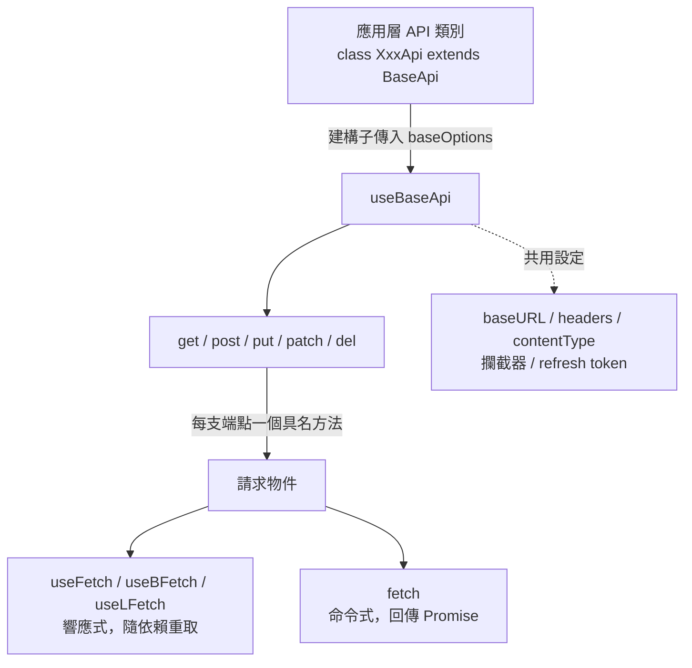

# API 用戶端（API Client）

## Summary

Camelot 的 API 層以 `useBaseApi` 為核心：一次設定 `baseURL`、標頭、攔截器與 refresh token 策略，之後每支端點各自取得一個請求物件，由呼叫端決定要用 `useFetch` 系列（響應式）或 `fetch`（命令式）。建議以 `class XxxApi extends BaseApi` 的應用層類別收斂設定與端點，元件只認具名方法、不碰 URL 字串。API 參考見 [useBaseApi](../composables/useBaseApi.md)。

---

## 🧭 組成與分工

| 單元 | 角色 |
| :--- | :--- |
| `useBaseApi(baseOptions)` | 工廠：綁定共用設定，回傳 `get` / `post` / `put` / `patch` / `del` |
| `BaseApi` | 類別包裝：建構子接收 `baseOptions`，`this.api` 即上述工廠的結果，供應用層繼承 |
| 各方法回傳的請求物件 | 一次請求的多種取用方式：`useFetch` / `useBFetch` / `useLFetch` / `fetch` |



---

## 🏗️ 建立應用層 API 類別（建議做法）

以 `BaseApi` 為基底，**建構子集中所有共用設定**，**每支端點一個具名 public 方法**：

```ts
class OrderApi extends BaseApi {
  constructor() {
    super({
      // baseURL 可傳 computed，讓執行期設定（如 runtimeConfig）生效
      baseURL: computed(() => useRuntimeConfig().public.apiBaseUrl),
      contentType: ContentType.Json,
      headers: defaultHeaders,
      onRequests: [useBearerTokenRequest(() => useAuthStore().accessToken ?? '')],
      autoRefreshToken: true,
      refreshTokenHandler: async () => {
        // 回傳 true 代表刷新成功，原請求會自動重送
        return await refreshAccessToken()
      },
    })
  }

  // 回傳請求物件而非直接 .fetch()，讓呼叫端自行選擇取用方式
  public getOrders(query?: MaybeRefOrGetter<OrderQuery>) {
    return this.api.get<OrderListResp>(() => '/orders', { query })
  }

  public postOrder(body: MaybeRefOrGetter<CreateOrderReq>) {
    return this.api.post<CreateOrderResp>(() => '/orders', { body })
  }
}

export const useOrderApi = () => new OrderApi()
```

要點：

- **不在方法內呼叫 `.fetch()`**：回傳請求物件，頁面要響應式就用 `useBFetch()`、要命令式就用 `fetch()`，同一支端點兩種情境共用。
- **URL 一律用 getter**（`() => '/orders'`）：`Url` 型別支援 `string | Request | Ref | (() => ...)`，getter 才能讓路徑中的變數參與響應式重取。
- **`query` / `body` 收 `MaybeRefOrGetter`**：搭配 `useFetch` 系列時，來源變動會自動重取。
- **型別放在泛型參數**：`this.api.get<Resp>(...)`，回應型別即端點契約。
- 可執行的同型範例見 `.playground/app/composables/useTestApi.ts`。

---

## 🎛️ 四種取用方式

| 方式 | 行為 | 適用情境 |
| :--- | :--- | :--- |
| `useFetch(coverOptions?)` | Nuxt `useFetch` 的原生包裝 | 需要原生回傳結構時 |
| `useBFetch(coverOptions?)`<br/>（別名 `useFetchBetter`） | 額外提供由 `status` 衍生的 `idle` / `pending` / `success` | **一般頁面載入的預設選擇** |
| `useLFetch(coverOptions?)`<br/>（別名 `useLazyFetch`） | `useBFetch` 的懶載入版：`immediate: false`、`watch: false`、`server: false`、`dedupe: 'defer'` | 由使用者操作觸發、不隨依賴自動重取 |
| `fetch(coverOptions?, _retryCount?, abortSignal?)` | 以 `$fetch` 送出並回傳 `Promise<DataT>`，可傳 `AbortSignal` | 送出表單、序列流程、需要 await 結果或中止請求 |

`coverOptions` 會覆寫該次呼叫的設定，不影響其他呼叫。

---

## 🧩 設定的合併規則

`baseOptions` 與單次 `options` 為**淺層合併**，同名鍵由 `options` 覆寫：

- 純量與物件鍵（`baseURL`、`headers`、`contentType`…）：後者整個取代前者。
- **攔截器陣列（`onRequests` / `onResponses` / `onResponseErrors`）同樣是取代而非串接**——單次呼叫若傳入 `onRequests`，該次請求就只會執行傳入的那組，base 上的不再生效。需要疊加時，請在單次陣列中一併列出要保留的攔截器。

---

## 🔐 認證與 refresh token

現成的請求攔截器：

| 匯出 | 用途 |
| :--- | :--- |
| `useBearerTokenRequest(tokenRef)` | 加上 `Authorization: Bearer <token>`，接受 ref 或 getter |
| `useBasicTokenRequest(accountRef, pwdRef)` | 加上 Basic 認證標頭 |
| `useBasicToken(account, pwd)` | 產生 Base64 字串 |
| `secureHeaderRequest` | 安全標頭（預設已由 `addSecureHeaderRequest` 自動掛上） |

自動刷新：

| 選項 | 說明 |
| :--- | :--- |
| `autoRefreshToken` | 啟用自動刷新與原請求重送 |
| `refreshTokenHandler` | 實際刷新邏輯，回傳 `true` 代表成功 |
| `shouldRefreshToken` | 自訂觸發條件，預設為 `response.status === 401` |
| `maxRefreshRetry` | 重試上限，預設 `1` |

**同一個 `refreshTokenHandler` 參考共用一把鎖**（模組層 `Map`）：多個請求同時遇到 401 只會觸發一次刷新，其餘等待同一個 Promise；不同 handler 互不影響。因此 handler 應是穩定的參考，不要每次呼叫都重新建立。

---

## ⚠️ `ignoreResponseError` 對攔截器的影響

開啟 `ignoreResponseError` 後，HTTP 4xx/5xx **不再拋出**，而是走 `onResponses`；`onResponseErrors` 只剩傳輸層錯誤（斷網、逾時、DNS）會進入。攔截器要據此擺放：狀態碼相關的處理放 `onResponses` 並自行判斷 `response.status`，連線層的處理放 `onResponseErrors`。自動 refresh token 在兩種模式下皆可運作。

---

## 🧰 其他機制

| 機制 | 說明 |
| :--- | :--- |
| `contentType` | 預設 `ContentType.Json`（自動帶 `Content-Type: application/json`）；上傳檔案用 `ContentType.MultiPartFormData` |
| `cachePolicy: 'cache'` | 透過 `useNuxtData` 取回快取；**需自行設定 key**，未設定則無效 |
| `transDateKeys` | 指定回應中哪些 key 要還原為 `Date`；內部改寫 `transform`，對陣列逐項或單一物件套用 |
| `addSecureHeaderRequest` | 預設 `true`，自動加上 `X-Content-Type-Options: nosniff` 與 `Referrer-Policy: same-origin` |

---

## 🔀 與其他系統的分工

- **串流**：`useBaseApi` 處理一次性請求；SSE 與逐行 JSON 請改用 [useFetchStream](../composables/useFetchStream.md) 與 [useFetchJSONLinesStream](../composables/useFetchJSONLinesStream.md)。
- **錯誤處理**：可自動回復的 401 在 API 層就地刷新並重送，不會進入全域管線；刷新也失敗、已無法回復的錯誤才交由 [錯誤處理系統](./error-handling.md) 提示。
- **分頁**：清單型端點可搭配 [useInfinitePage](../composables/useInfinitePage.md)。

---

## References

- [useBaseApi](../composables/useBaseApi.md) — 完整 API 參考（簽章、`ApiFetchOptions` 全欄位）
- [錯誤處理系統](./error-handling.md) — 全域錯誤佇列與本頁的分工
- `.playground/app/composables/useTestApi.ts` — 可執行的應用層 API 類別範例

---

[🚨 錯誤處理系統](./error-handling.md) | [🪝 Composable 清單](./composables.md) | [⚙️ 環境變數](../environment.md) | [🏠 Wiki](../index.md)
