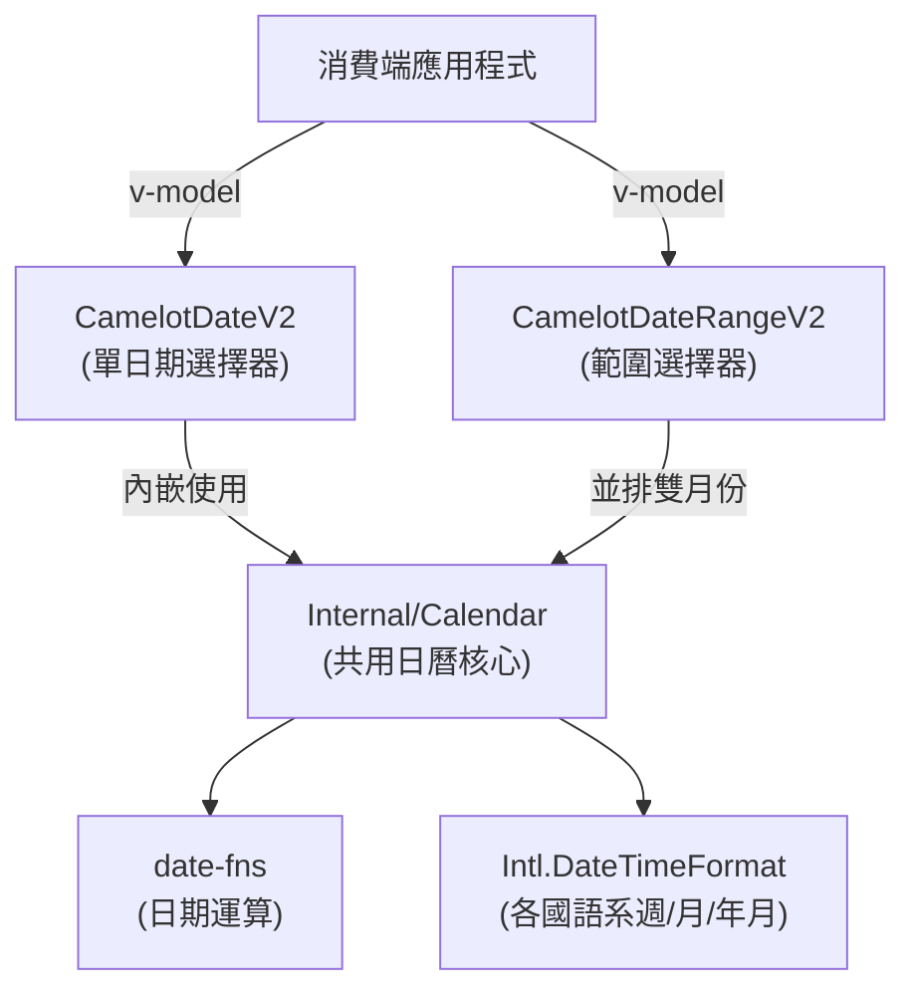
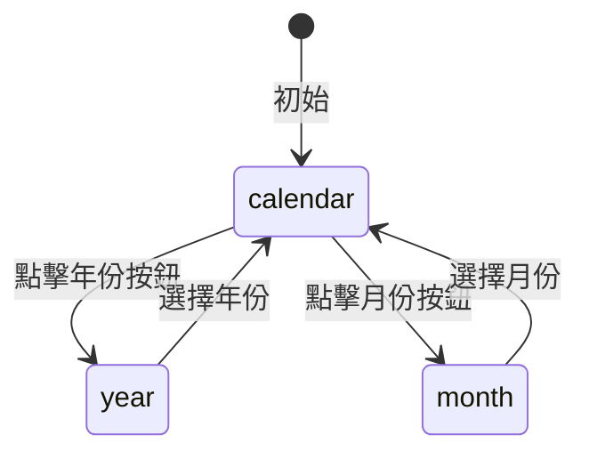
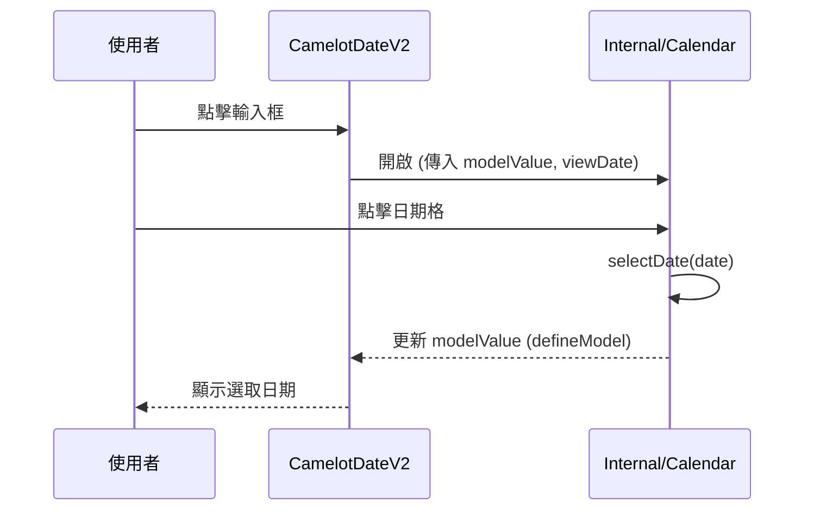
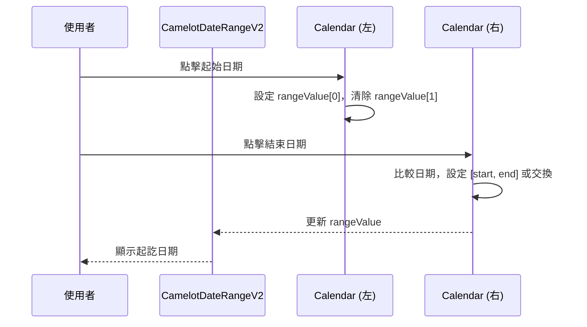

# 🗓️ Calendar / 日期選擇器系統

本頁記錄 Camelot Nuxt Layer 中日期選擇器家族的架構、Props 規格與互動流程。

> [!WARNING]
> `DateV2` 與 `DateRangeV2` 元件正在**重構進行中 (🚧)**，相關計畫請見 `.kn-project/plans/`。

---

## 架構總覽

日期選擇器系統由三個層次組成：



> DateV2 / DateRangeV2 皆轉發 `showDayLabel` / `locale` / `weekStartsOn` / `weekdayFormatter` / `monthFormatter` / `yearFormatter` 給 Calendar。

---

## 元件規格

### `Internal/Calendar.vue` — 日曆核心

共用的日曆核心元件，被 `DateV2` 與 `DateRangeV2` 使用。

#### Props

| Prop | 型別 | 預設值 | 說明 |
| :--- | :--- | :---: | :--- |
| `isRange` | `boolean` | `false` | 是否為範圍選擇模式 |
| `minDate` | `Date \| number` | — | 可選最早日期 |
| `maxDate` | `Date \| number` | — | 可選最晚日期 |
| `hidePrevMonth` | `boolean` | `false` | 是否隱藏上個月日期格 |
| `hideNextMonth` | `boolean` | `false` | 是否隱藏下個月日期格 |
| `enableTime` | `boolean` | `false` | 是否顯示時間選擇器 |
| `hidePrevArrow` | `boolean` | `false` | 是否隱藏上個月箭頭 |
| `hideNextArrow` | `boolean` | `false` | 是否隱藏下個月箭頭 |
| `getDayAttributes` | `(date: Date, dayOfWeek: number) => CalendarDayAttributes \| null` | — | 自訂每日屬性回調（節日/label/dot…） |
| `showDayLabel` | `boolean` | `true` | 是否顯示日期下方 label；關閉則不渲染、格高緊湊（開 `min-h-[52px]`／關 `min-h-9`） |
| `locale` | `string`（BCP47） | —（預設中文） | 語系。未給→預設中文（繁中）；給了以 `Intl` 產生週/月/年月名。**中文（含繁/簡 `zh-*`）一律用預設 `日一二`/`一月`/`yyyy年` 格式**，避免 Intl 中文週名帶「週」 |
| `weekStartsOn` | `0 \| 1` | `0` | 每週起始：0=週日、1=週一 |
| `weekdayFormatter` | `(date, index) => string` | — | 自訂週名（優先序最高，覆蓋 locale/預設） |
| `monthFormatter` | `(monthIndex) => string` | — | 自訂月名（月份選擇格＋月標題） |
| `yearFormatter` | `(year) => string` | — | 自訂年標題 |

#### defineModel (雙向綁定)

| Model 名稱 | 型別 | 說明 |
| :--- | :--- | :--- |
| `modelValue` | `Date \| number \| null` | 單選日期值 |
| `rangeValue` | `(Date \| number \| null)[] \| null` | 範圍選擇值 `[start, end]` |
| `viewDate` | `Date`（required） | 當前日曆顯示月份 |

#### CalendarDayAttributes 介面

```typescript
export interface CalendarDayAttributes {
  isHoliday?: boolean    // 是否為假日（標紅色）
  label?: string | null  // 日期下方顯示的文字 Label
  labelClass?: string    // Label 的 CSS class
  disabled?: boolean     // 是否禁用此日期
  dot?: boolean          // 是否顯示小點標記
  dotColor?: string      // 小點的自訂顏色（CSS color string）
  class?: string         // 日期格的額外 CSS class
}
```

#### 選擇器模式 (pickerMode)



#### 顏色邏輯規則

| 條件 | 套用顏色 |
| :--- | :--- |
| 週末 (日/六) 或 `isHoliday` | `text-error` (紅色) |
| 已選取日期 | `bg-primary text-on-primary` (圓形背景) |
| 今日 | `text-primary` (主色) |
| 範圍內 | `bg-primary/10` (淡主色背景) |
| 其他當月日期 | `text-on-surface` |
| 相鄰月份日期 | `text-outline opacity-50` |

---

## 節日標記 / 各國語系 / 緊湊模式

### 節日（`getDayAttributes`）

`isHoliday` 與 `label` **解耦**，可獨立配置：
- `{ isHoliday: true }`：僅標紅字（放假色），不顯示名稱。
- `{ label: '國慶' }`：僅顯示節日名（不變紅）→ 「有節日但不放假」。
- `{ isHoliday: true, label: '春節' }`：紅字＋名稱。

### 緊湊模式（`showDayLabel`）

日期與 label 為兩個獨立元素；`showDayLabel: false` 不渲染 label，格高由 `min-h-[52px]`（開）降為 `min-h-9`（關）→ 不需 label 時無多餘空間。

### 各國語系（`locale` / `weekStartsOn` / formatters）

- 週名/月名/年月標題以 `Intl.DateTimeFormat` 產生（週名 `weekday: 'short'`、月名 `month: 'long'`）。
- **未給 `locale` → 預設中文（繁中）**；`zh-*`（繁/簡）一律走預設中文格式（`日一二`、`一月`、`yyyy年`），避免 Intl 中文週名帶「週/周」。
- `weekStartsOn` 對齊 `startOfWeek` 與週名旋轉；`th-TH` 由 Intl 顯示佛曆年。
- 優先序：**自訂 formatter > Intl（非中文）> 預設中文**。
- 註：**RTL 版面未支援**（文字用 Intl、佈局維持 LTR）。

---

## 狀態流程圖

### 單日期選擇 (`isRange: false`)



### 範圍選擇 (`isRange: true`)



---

## 相關計畫

| 計畫 | 狀態 | 說明 |
| :--- | :--- | :--- |
| [2604131355-refactor-calendar-define-model](../plans/2604131355-refactor-calendar-define-model/plan.md) | 🚧 進行中 | 將 Calendar 改為 `defineModel` |
| [2604131417-propagate-calendar-updates](../plans/2604131417-propagate-calendar-updates/plan.md) | 🚧 進行中 | 傳播 `getDayAttributes` 更新 |
| [2604131437-fix-calendar-type-errors](../plans/2604131437-fix-calendar-type-errors/plan.md) | 🚧 進行中 | 修復 TypeScript 型別問題 |
| [2604131441-unify-calendar-colors-and-2-line-label](../plans/2604131441-unify-calendar-colors-and-2-line-label/plan.md) | 🚧 進行中 | 統一顏色控制與換行 Label |
| [2604131510-refactor-daterange-separate-inputs](../plans/2604131510-refactor-daterange-separate-inputs/plan.md) | 🚧 進行中 | DateRangeV2 改為雙獨立 Input |

---

## References

- [date-fns 官方文件](https://date-fns.org/)
- [Vue 3 defineModel RFC](https://vuejs.org/guide/components/v-model)
- [MDN Intl.DateTimeFormat](https://developer.mozilla.org/docs/Web/JavaScript/Reference/Global_Objects/Intl/DateTimeFormat)
- 計畫歸檔：`../../archive/2607091145-datepicker-daylabel-locale.md`（locale / showDayLabel / formatter）

---

[🏠 Wiki](../index.md)
