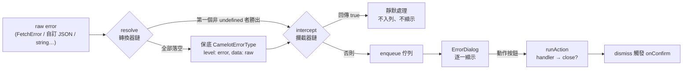

# 錯誤處理系統（佇列 + 轉換器 + 攔截器）

## Summary

Camelot 的全域錯誤機制由 [useCamelotError](./composables/useCamelotError.md) 的佇列與 [ErrorDialog](./components/ErrorDialog.md) 的顯示層組成，可累積多筆錯誤並逐一呈現。
入口只接受 `CamelotErrorType`，任意原始錯誤必須經由**消費端註冊的轉換器**轉成該型別，副作用則由**攔截器**負責，因此換一套 API 錯誤格式不需要改動 Layer。
Layer 只內建 `FetchError` / `Error` / `string` 三個無業務語意的轉換器；401 導向登入這類行為一律由消費端註冊。

## 管線

`handle(raw)` 是接收原始錯誤的唯一入口，分三段推進：



| 階段 | 職責 | 不該做什麼 |
| :--- | :--- | :--- |
| **resolve** | 純轉換：`unknown` → `CamelotErrorType` | 不做副作用。轉換器若兼做清權限／導頁，「只是想轉個格式」的情境也會被觸發 |
| **intercept** | 副作用：清除權限、記錄 log、掛上 `onConfirm`；回傳 `true` 可攔下不入列 | 不改寫錯誤的顯示語意（那是 resolve 的事） |
| **enqueue** | 入列並由 `ErrorDialog` 逐一呈現 | — |

轉換器與攔截器皆可註冊 N 個，`priority` 數字大者先跑（未指定為 `0`，內建轉換器為 `-100`）。註冊表為模組層 `Map`，同名視為覆蓋，註冊函式回傳註銷函式。

## 消費端註冊（以 401 為例）

三個需求各自落在管線的一段：**清除權限**在 intercept、**跳出對話框**由入列後的 `ErrorDialog` 負責、**確認後回登入**在 `onConfirm`。

```ts
// plugins/camelotError.ts
export default defineNuxtPlugin(() => {
  const { registerErrorResolver, registerErrorInterceptor } = useCamelotError()

  // 轉換：把後端的 401 轉成統一模型（無副作用）
  registerErrorResolver({
    name: 'unauthorized',
    priority: 100,
    resolve: (raw) => {
      if (!isFetchError(raw) || raw.statusCode !== 401) return undefined
      return { code: 401, message: '登入逾期，請重新登入', data: raw.data }
    },
  })

  // 攔截：清權限（立即），導頁掛到 onConfirm（對話框關閉後才跑）
  registerErrorInterceptor({
    name: 'unauthorized',
    intercept: (error) => {
      if (error.code !== 401) return
      useAuthStore().clear()
      error.onConfirm = () => navigateTo('/login')
    },
  })
})
```

自訂 API 錯誤格式同理，只註冊 resolver 即可：

```ts
registerErrorResolver<ApiErrorPayload>({
  name: 'api-error',
  priority: 100,
  resolve: raw => isApiErrorPayload(raw)
    ? { code: raw.errorCode, message: raw.errorMessage, data: raw }
    : undefined,
})
```

## 呼叫端控制

`push` / `handle` / `watch` 共用同一組 `CamelotErrorOptions`，讓觸發錯誤的頁面就地決定行為：

```ts
const { error } = await useFetch('/api/orders')

// 確認後回上一頁
useCamelotError().watch(error, { onConfirm: () => router.back() })
```

- **動作欄位（`positive` / `neutral` / `negative`）為覆寫** — 呼叫端比轉換器更貼近當下情境。
- **`onConfirm` 為串接** — 呼叫端的先跑、錯誤自帶的後跑。攔截器掛的多為導頁這類終結性動作，排最後才不會讓呼叫端邏輯被跳過。

## 多動作按鈕與重試

錯誤可帶 `positive` / `neutral` / `negative` 三顆按鈕（型別 `CamelotErrorAction`），直接對映 `ConfirmDialog` 的按鈕槽。`close: false` 代表按下後**不自動關閉**，由呼叫端自行控制關閉時機：

```ts
push({
  title: '連線失敗',
  message: '無法取得資料，請稍後再試。',
  positive: { label: '重試', close: false, handler: retry },
  negative: { label: '關閉' },
})

const retry = async () => {
  // 自行關閉，loading 才不會被對話框蓋住
  dismiss()
  const closeLoading = useLoading().open('重新連線中...')
  await request()
  closeLoading()
}
```

## 與其他機制的分工

| 機制 | 負責範圍 |
| :--- | :--- |
| **useCamelotError** | 非致命、可累積、需逐一提示的錯誤 |
| **Nuxt `useError` / `showError`** | 致命錯誤：只承載單一 `NuxtError`，且會中止當前頁渲染切換到 `error.vue` |
| **[useBaseApi](./composables/useBaseApi.md) 的 `autoRefreshToken`** | **可自動回復**的 401：在 API 層就地刷新 token 並重送，根本不會進入本管線。本管線處理的是刷新也失敗、已無法回復的 401 |
| **[useCamelotToast](./composables/useCamelotToast.md)** | 不需要使用者確認的輕量提示 |
| **[useErrorRef](./composables/useErrorRef.md)** | 只把多個錯誤 ref 匯總成一個 ref，不含佇列、轉換與顯示 |

## References
- 元件 API：[ErrorDialog](./components/ErrorDialog.md)、[ConfirmDialog](./components/ConfirmDialog.md)
- Composable API：[useCamelotError](./composables/useCamelotError.md)
- 示範程式碼：`.playground/app/pages/index.vue` 的 Global Error Queue 卡片

---
[🧩 元件清單](./components.md) ・ [🪝 Composable 清單](./composables.md) ・ [🏠 Wiki](../index.md)
