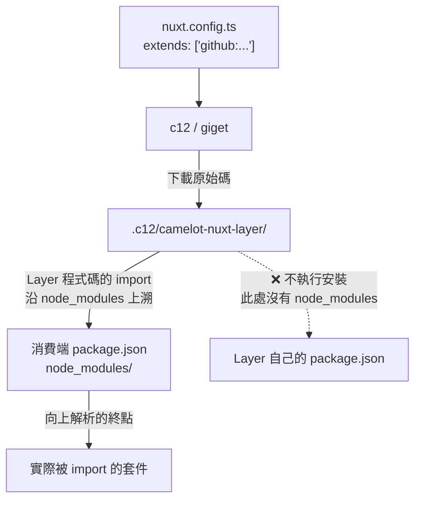

# 📦 Layer 整合與必裝依賴 (Consumer Integration)

## Summary

消費端專案以 `extends: ['github:KNightING/camelot-nuxt-layer']` 引入本 Layer 時，c12/giget 只把原始碼抓進消費端的 `.c12/` 目錄，**不在該目錄安裝 Layer 的依賴**。
Layer 的 import 沿 `node_modules` 向上解析到消費端專案，因此所有被 Layer 原始碼直接 import 的套件都必須由**消費端自行宣告**，否則整合會失敗。

## 依賴解析模型

**推論**：Layer 的 `package.json` 對消費端**完全沒有約束力**——它既不是 peer dependency 宣告，也不會被安裝。消費端必須自己重建這份清單。

## 必裝依賴清單

| 套件 | 被誰直接 import | 缺少時的症狀 |
| :--- | :--- | :--- |
| `@tailwindcss/vite` | `nuxt.config.ts:8` | Layer config 載入即失敗 |
| `@nuxt/kit` | `modules/buildHook.ts:1`、`modules/echartModule.ts:1`、`modules/tappay.ts:1` | **啟動立即中止**：`Cannot find module '@nuxt/kit'` |
| `@tiptap/core`、`/pm`、`/starter-kit`、`/vue-3`、`/extension-image`、`/extension-link`、`/extension-placeholder` | `app/components/Camelot/RichTextEditor.vue` | 使用 RichTextEditor 的頁面編譯時才報錯 |
| `date-fns` | `DateV2` / `DateRangeV2` / `TimeV2` 及相關 composables | 使用日期元件的頁面編譯時才報錯 |
| `change-case` | composables | 引用時才報錯 |
| `@iconify-json/material-symbols`、`@iconify-json/ic` | 元件內的 `~icons/...` 虛擬模組（如 `app/components/Camelot/Breadcrumb.vue:50`） | 圖示解析失敗 |
| `pinia`、`pinia-plugin-persistedstate` | stores | Pinia 模組載入失敗 |
| `@vueuse/core`、`@vueuse/nuxt`、`@vueuse/components`、`@vueuse/integrations` | composables 與元件 | 引用時才報錯 |
| `nuxt`、`tailwindcss`、`unplugin-icons`、`unplugin-vue-components`、`@nuxtjs/i18n`、`@pinia/nuxt`、`@nuxt/eslint` | Layer `nuxt.config.ts` 的 `modules` / `vite.plugins` | 啟動失敗 |

> 具體版本以 Layer 的 `package.json` 為準；README 的安裝章節載有可直接複製的 `package.json` 片段。

## 失敗模式

整合失敗分兩類，**後者最難排查**：

| 類型 | 觸發時機 | 代表 |
| :--- | :--- | :--- |
| **立即中止** | Nuxt 啟動的模組解析階段 | `@nuxt/kit`、`@tailwindcss/vite` |
| **延遲失敗** | 用到該元件的頁面**被編譯時**才爆 | `@tiptap/*`、`date-fns`、`@iconify-json/*` |

延遲失敗的後果是：`pnpm dev` 看似正常，直到某個頁面第一次被存取才報 Cannot find module。**補齊時要照整份清單補，不要只裝報錯的那一個。**

### `@nuxt/kit` 為何是硬性中止點

`modules/*.ts` 由 jiti 以 CJS `require.resolve('@nuxt/kit')` 載入，發生在 Nuxt 啟動的模組解析階段。pnpm 的嚴格 `node_modules` 不提升傳遞依賴，消費端未直接宣告時解析不到，`pnpm dev` 立刻中止。

> Layer 自身的 `package.json` 也未宣告 `@nuxt/kit`（僅由 `nuxt` 傳遞取得），屬同一類脆弱性，尚未處理。

## References

- 計畫歸檔：`../../archive/2608190042-readme-refresh-and-wiki-links.md`
- i18n 註冊分工與已知缺陷：[i18n 語系系統](./i18n-locales.md)
- [c12 — extends](https://github.com/unjs/c12#extending-configuration)

---

[🌐 i18n 語系系統](./i18n-locales.md) | [⚙️ 環境變數](../environment.md) | [🏠 Wiki](../index.md)
