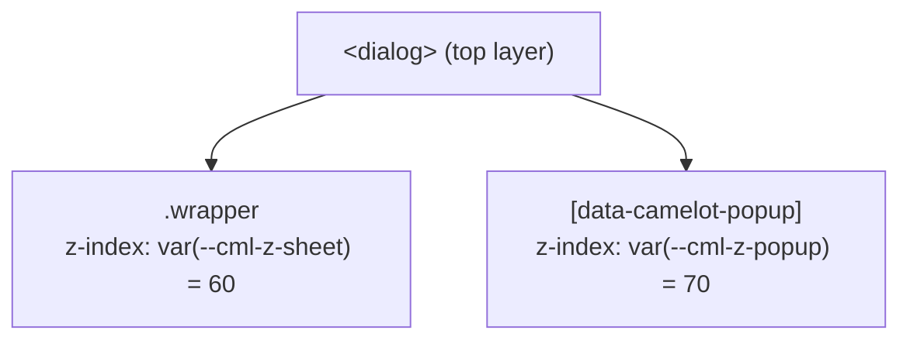

# 🧱 Layering / 疊層刻度

## Summary

Camelot 的浮動元件（Drawer、BottomSheet、Popup）以 `tailwind.css` 中一組具名 CSS 變數決定 z-index，而非各自硬編碼數字。刻度定義於一般 `:root`，元件一律以 `var(--cml-z-*)` 引用。浮層要在 `<dialog>` 內可見，還必須先經由 [useCamelotTeleportTarget](./composables/useCamelotTeleportTarget.md) teleport 進該對話框——層級只在同一堆疊脈絡內才有意義。

---

## 刻度

定義於 `app/assets/css/tailwind.css` 的 `:root`：

| 變數 | 值 | 使用者 |
| :--- | ---: | :--- |
| `--cml-z-drawer` | `50` | [Drawer](./components/Drawer.md) floating 模式的 Teleport 容器 |
| `--cml-z-sheet` | `60` | [BaseBottomSheetV2](./components/BaseBottomSheetV2.md) 的面板容器 |
| `--cml-z-popup` | `70` | [PopupV2](./components/PopupV2.md) 浮層預設層級；[CascadeMenu](./components/CascadeMenu.md) 面板為 `calc(var(--cml-z-popup) + level)`（逐層 +1）；TimeV2 / DateV2 的內層時分秒清單為 `calc(var(--cml-z-popup) + 1)` |

## 為什麼 popup 必須高於 sheet / drawer

所有 popup 概念的元件都經由 [useCamelotTeleportTarget](./composables/useCamelotTeleportTarget.md) 把浮層 **Teleport 進最近的 `<dialog>`**（沒有則回落 `body`），以繞開原生 `<dialog>` 的 top layer 限制。此時浮層與 BottomSheet 的面板容器成為**同一個堆疊脈絡下的兄弟節點**，純粹比 z-index 大小。若 popup 低於面板，Sheet 內的下拉選單就會被面板蓋住。

> [!IMPORTANT]
> 兩者有先後關係：**沒有先 teleport 進 `<dialog>`，調高 z-index 完全無效**——`body` 底下的內容永遠在對話框 top layer 之下，開到多大都一樣。

## 規則

- **元件不得就地寫死 z-index 數字**，一律引用刻度變數。所有 popup 概念的元件（PopupV2、CascadeMenuPanel、TimeField）皆已收斂；仍有硬編碼值的是非 popup 類（Loading `1100`、Toast `1000`、Carousel `150/200` 等），新增或修改時應優先改用刻度。
- **需要疊在同層浮層之上時用 `calc()` 而非更大的固定值**，例如浮層內的子清單寫 `calc(var(--cml-z-popup) + 1)`。相同 z-index 會退回以 DOM 順序決定先後，那取決於 Teleport 的插入時機，多個浮層並存時不可預測。
- **刻度置於一般 `:root`，不要移進 `@theme`。** Tailwind v4 的 `@theme` 會 tree-shake 掉未被引用的變數 —— 實測 `--cml-z-drawer` 在無人引用時直接不存在，使「預留刻度」在首次被引用前失效。
- 使用端仍可透過元件的 `zIndex` prop 覆寫個別實例。

## References

- `app/assets/css/tailwind.css` — 刻度定義
- [PopupV2](./components/PopupV2.md) ・ [BaseBottomSheetV2](./components/BaseBottomSheetV2.md) ・ [BaseDialogV2](./components/BaseDialogV2.md)

---
[🗂️ 元件清單](./components.md) ・ [🏠 Wiki](../index.md)
