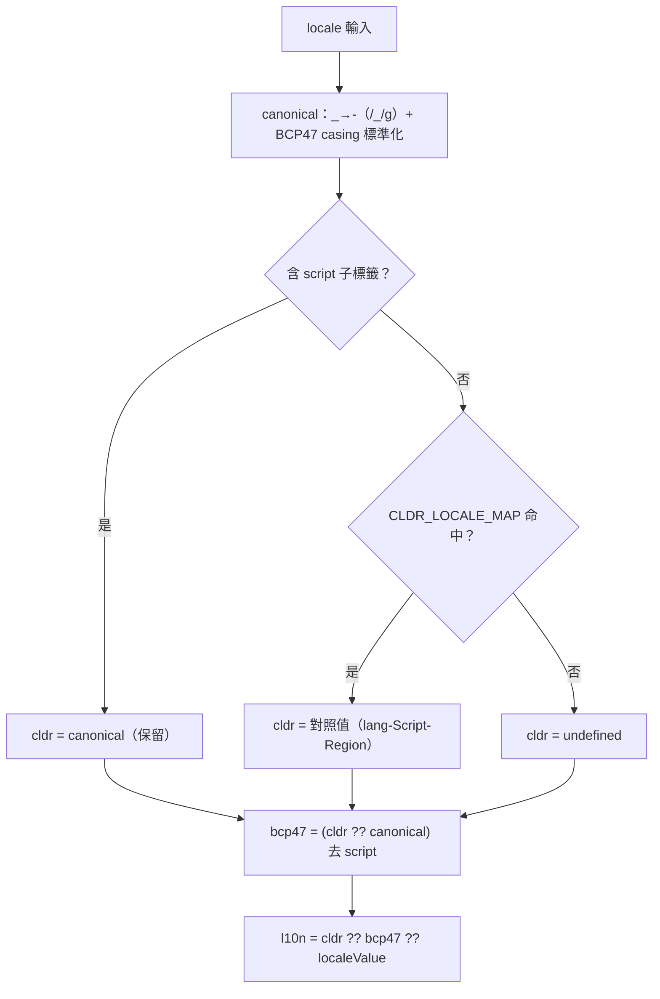

# 🌐 useLocale（語系格式正規化）

> 將單一 locale 字串正規化為三種國際化格式表示：`bcp47`、`cldr`、`l10n`。輸入可為 **bcp47 或 cldr 格式**、大小寫不敏感、`_`/`-` 分隔皆可。對應計畫 `2606261225`。

## 概要
- **入參**：`useLocale(locale: MaybeRefOrGetter<string | undefined>)`；回傳三個 `computed`。
- **`bcp47`**：正規化後**移除 script 子標籤**（保留 region），由 `cldr` 反推。如 `zh-Hant-TW` → `zh-TW`。
- **`cldr`**：常見語言補上完整 `lang-Script-Region`；輸入已自帶 script 則保留；非清單語言回 `undefined`。
- **`l10n`**：fallback 鏈 `cldr ?? bcp47 ?? localeValue`。

## 解析流程

## CLDR_LOCALE_MAP（11 語言，僅帶 region 的 key）
- **設計決策**：移除所有「裸語言碼」key（`zh`/`sr`…），只保留帶 region 者；裸碼一律不擴展，與非清單語言（`en`）行為一致。
- 涵蓋：中文 `zh`、塞爾維亞 `sr`、烏茲別克 `uz`、亞塞拜然 `az`、哈薩克 `kk`、蒙古 `mn`、庫德 `ku`、旁遮普 `pa`、信德 `sd`、塔吉克 `tg`、韃靼 `tt`。
- 例：`zh-CN`→`zh-Hans-CN`、`zh-TW`→`zh-Hant-TW`、`sr-ME`→`sr-Latn-ME`、`mn-CN`→`mn-Mong-CN`、`uz-AF`→`uz-Arab-AF`、`pa-PK`→`pa-Arab-PK`、`sd-IN`→`sd-Deva-IN`。

## 行為範例
| 輸入 | bcp47 | cldr | l10n |
| :--- | :--- | :--- | :--- |
| `zh-TW` / `zh-Hant-TW` / `zh_Hant_TW` / `ZH-tw` | `zh-TW` | `zh-Hant-TW` | `zh-Hant-TW` |
| `zh-CN` | `zh-CN` | `zh-Hans-CN` | `zh-Hans-CN` |
| `zh`（裸碼） | `zh` | `undefined` | `zh` |
| `zh-Hant`（僅 script） | `zh` | `zh-Hant` | `zh-Hant` |
| `en-US` | `en-US` | `undefined` | `en-US` |
| `undefined` | `undefined` | `undefined` | `undefined` |

## References
- 實作：`app/composables/useLocale.ts`
- 計畫歸檔：`.kn-project/archive/2606261225-use-locale-cldr-l10n.md`
- 對照表資料來源：使用者提供之 CLDR locale → script/region 清單
- 專案 i18n 語系註冊與 fallback 鏈：[[i18n-locales]]([i18n 語系系統](./i18n-locales.md))

---

[🌐 i18n 語系系統](./i18n-locales.md) | [🏷️ 表單控制元件](./field-label-and-form-controls.md) | [🎨 主題系統](./theme-system.md) | [🏠 Wiki](../index.md)
