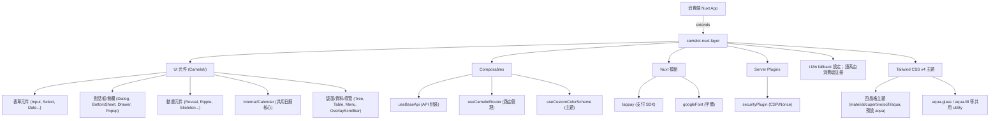

# 📚 Camelot Nuxt Layer — Wiki 首頁

> 本 Wiki 是專案知識的中樞，涵蓋架構、元件/Composable API 目錄、環境設定與開發規範。

## 🌐 語言切換 (Language Switcher)
- 🇹🇼 **正體中文** (當前)
- 🇺🇸 [English](./lang/en-US/index.md) *(尚未建立)*

---

## 📋 專案概覽

**Camelot Nuxt Layer** 是一個 Nuxt Layer 形式的 UI 元件函式庫，提供各種可複用的 Vue 3 元件、Composables 與工具模組，供各類 Nuxt 4 應用程式擴展使用。

| 項目 | 說明 |
| :--- | :--- |
| **套件名稱** | `camelot-nuxt3-layer` |
| **版本** | 以 `package.json` 為準（撰寫時為 `4.5.2.0`） |
| **框架** | Nuxt 4 + Vue 3 (Composition API) |
| **樣式** | Tailwind CSS v4 |
| **狀態管理** | Pinia + pinia-plugin-persistedstate |
| **多語系** | @nuxtjs/i18n（語系**全部由消費端註冊**；Layer 的 `en` / `zh` 基底字典目前未生效，見 [i18n 語系系統](./features/i18n-locales.md)） |
| **套件管理** | pnpm |

---

## 🗂️ API 清單矩陣 (Inventory Matrix)

每個 component / composable 皆有**獨立 API 頁**（Props / Emits / v-model / Slots / Exposed / 簽章 / 回傳）：

| 矩陣 | 內容 |
| :--- | :--- |
| **[🧩 元件清單矩陣](./features/components.md)** | 全部 ~89 元件（表單 / 版面 / 覆蓋層 / 回饋 / 媒體 / 主題變體 / 內部），每個一頁 |
| **[🪝 Composable 清單矩陣](./features/composables.md)** | 全部 ~48 composable（主題 / 元件相關 / API / 驗證 / 儲存 / 路由 / DOM / 工具），每個一頁 |

> 元件為 Nuxt 自動匯入 `Camelot<Name>`；主題子元件（Aqua/Material/Cupertino/Scifi）與 `Internal/` 為實作細節，由公開元件自動選用。

---

### 🧩 Nuxt 模組 (`modules/`)

| 模組 | 狀態 | 說明 |
| :--- | :---: | :--- |
| `tappay` | ✅ | 依 `runtimeConfig` 條件注入 TapPay SDK |
| `googleFont` | ✅ | 自動注入 Noto Sans TC Google Fonts |
| `buildHook` | ✅ | 建置期 Hook |
| `echartModule` | ✅ | ECharts 整合模組 |

### 🖥️ 伺服器功能 (`server/`)

| 項目 | 狀態 | 說明 |
| :--- | :---: | :--- |
| `server/plugins/securityPlugin` | ✅ | CSP Headers、Nonce 注入、安全標頭設定 |
| `server/api/version` | ✅ | `GET /api/version` — 回傳應用程式版本號 |

---

## 🗺️ 架構圖

---

## 📎 主題頁 (Topics)

每頁的說明見該頁的 `## Summary`；元件與 composable 的逐頁索引見上方的清單矩陣。

- [API 用戶端（API Client）](./features/api-client.md)
- [🗓️ Calendar / 日期選擇器系統](./features/calendar.md)
- [🎨 Color Scheme / 色彩主題系統](./features/color-scheme.md)
- [🗓️🪟🔔 DatePicker 時間/確認・Aqua 邊框 Token・Toast 動畫批次](./features/datepicker-time-aqua-toast.md)
- [錯誤處理系統（佇列 + 轉換器 + 攔截器）](./features/error-handling.md)
- [🏷️ FieldLabel 共通標籤與表單控制元件調整](./features/field-label-and-form-controls.md)
- [📎 檔案拖曳系統（FileDropzone / FileChip / useCamelotFileDrop）](./features/file-drop.md)
- [🌐 i18n 語系系統(CLDR 代碼 + Fallback 鏈 + Layer/消費端分工)](./features/i18n-locales.md)
- [📦 Layer 整合與必裝依賴 (Consumer Integration)](./features/layer-integration.md)
- [🧱 Layering / 疊層刻度](./features/layering.md)
- [🧱 Drawer / Tree / Table / Menu / CascadeMenu](./features/layout-data-components.md)
- [🌐 useLocale（語系格式正規化）](./features/locale.md)
- [📜 OverlayScrollbar / 自訂捲軸系統](./features/overlay-scrollbar.md)
- [🧩 Pagination / VirtualScroll / Carousel + 主題色彩批次](./features/pagination-virtualscroll-carousel.md)
- [📊 Progress 元件（ProgressBar / ProgressCircle / ProgressStage）](./features/progress-components.md)
- [🔘 Radio 與選項群組（RadioGroup / CheckboxGroup）](./features/radio-and-groups.md)
- [✍️🖼️ RichTextEditor（TipTap）與 ImageDropzone](./features/richtext-editor-image-dropzone.md)
- [🎨 主題系統 / Theme System（四風格 + Aqua）](./features/theme-system.md)
- [⏰ CamelotTimeV2（純時間選擇器）](./features/time-picker.md)
- [🕒 Timeline 時間軸](./features/timeline.md)
---

[🧩 元件清單](./features/components.md) | [🪝 Composable 清單](./features/composables.md) | [⚙️ 環境變數](./environment.md) | [🏠 Wiki](index.md)
